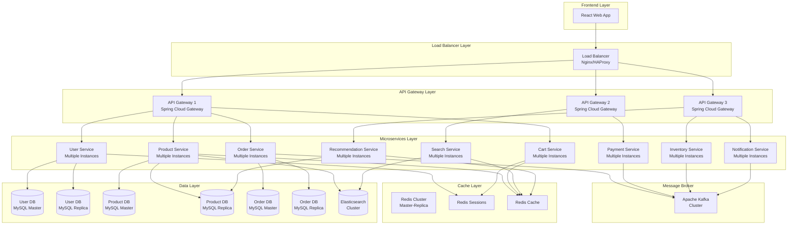
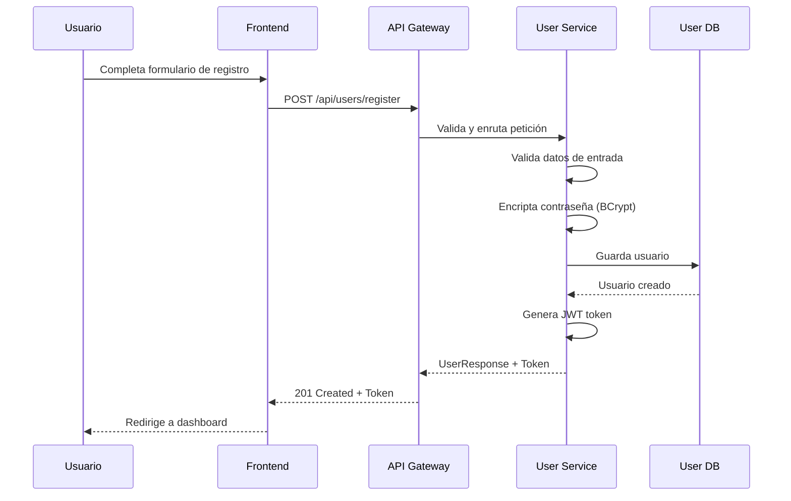
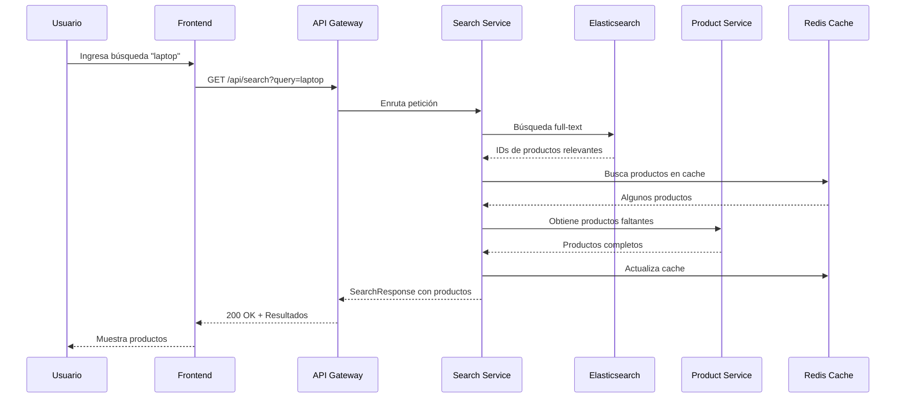
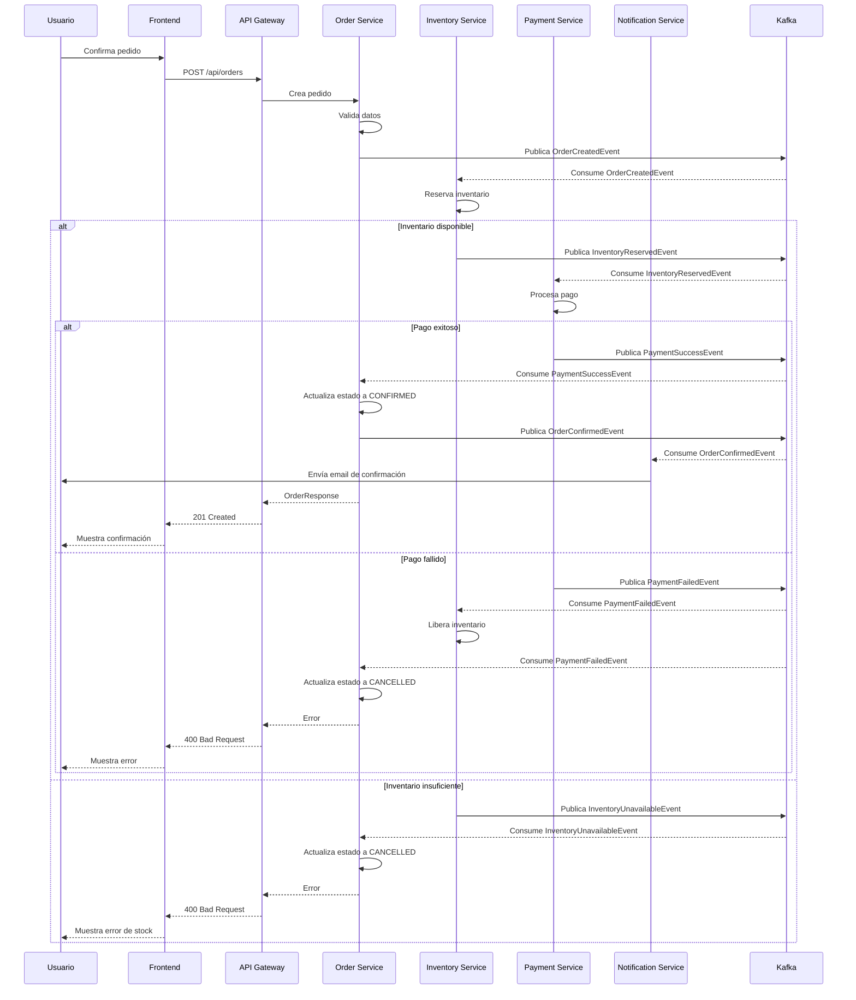

Amazon E-Commerce
# Documento de Diseño Técnico: Amazon Clone E-Commerce

## Resumen Ejecutivo

Este documento describe el diseño técnico completo de una plataforma e-commerce tipo Amazon, implementada con arquitectura de microservicios. El sistema utiliza Java 21 con Spring Boot para el backend, React con TypeScript para el frontend, Apache Kafka para mensajería asíncrona, y MySQL como base de datos principal. La plataforma soporta funcionalidades completas de comercio electrónico incluyendo gestión de productos, carrito de compras, procesamiento de pedidos, pagos, gestión de usuarios, búsqueda avanzada, recomendaciones, y soporte multiidioma (Español/Inglés).

## Arquitectura del Sistema

### Arquitectura de Alto Nivel

El sistema sigue una arquitectura de microservicios con los siguientes componentes principales:



### Patrones Arquitectónicos Aplicados

- **Microservices Architecture**: Servicios independientes y desplegables
- **Load Balancer Pattern**: Distribución de carga entre múltiples instancias de API Gateway
- **API Gateway Pattern**: Punto de entrada único para todas las peticiones
- **Event-Driven Architecture**: Comunicación asíncrona mediante Kafka
- **CQRS (Command Query Responsibility Segregation)**: Separación de lecturas y escrituras en servicios críticos
- **Database per Service**: Cada microservicio tiene su propia base de datos
- **Cache-Aside Pattern**: Cache distribuido con Redis para optimizar lecturas
- **Circuit Breaker Pattern**: Resiliencia ante fallos de servicios
- **Saga Pattern**: Transacciones distribuidas para pedidos
- **Read Replica Pattern**: Réplicas de lectura de MySQL para escalabilidad


## Componentes y Servicios

### 1. Load Balancer (Nginx/HAProxy)

**Propósito**: Distribuir tráfico entrante entre múltiples instancias de API Gateway para alta disponibilidad y escalabilidad.

**Tecnologías**: Nginx o HAProxy

**Configuración Principal**:

```nginx
# nginx.conf
upstream api_gateway_backend {
    least_conn;  # Algoritmo de balanceo por menor número de conexiones
    
    server api-gateway-1:8080 max_fails=3 fail_timeout=30s;
    server api-gateway-2:8080 max_fails=3 fail_timeout=30s;
    server api-gateway-3:8080 max_fails=3 fail_timeout=30s;
}

server {
    listen 80;
    listen 443 ssl http2;
    
    ssl_certificate /etc/nginx/ssl/cert.pem;
    ssl_certificate_key /etc/nginx/ssl/key.pem;
    
    # Configuración SSL/TLS
    ssl_protocols TLSv1.2 TLSv1.3;
    ssl_ciphers HIGH:!aNULL:!MD5;
    ssl_prefer_server_ciphers on;
    
    # Health check endpoint
    location /health {
        access_log off;
        return 200 "healthy\n";
        add_header Content-Type text/plain;
    }
    
    # Proxy a API Gateway
    location / {
        proxy_pass http://api_gateway_backend;
        proxy_http_version 1.1;
        
        # Headers para mantener información del cliente
        proxy_set_header Host $host;
        proxy_set_header X-Real-IP $remote_addr;
        proxy_set_header X-Forwarded-For $proxy_add_x_forwarded_for;
        proxy_set_header X-Forwarded-Proto $scheme;
        
        # Timeouts
        proxy_connect_timeout 60s;
        proxy_send_timeout 60s;
        proxy_read_timeout 60s;
        
        # Buffering
        proxy_buffering on;
        proxy_buffer_size 4k;
        proxy_buffers 8 4k;
        
        # Retry en caso de fallo
        proxy_next_upstream error timeout invalid_header http_500 http_502 http_503;
        proxy_next_upstream_tries 2;
    }
    
    # Rate limiting global
    limit_req_zone $binary_remote_addr zone=global_limit:10m rate=100r/s;
    limit_req zone=global_limit burst=200 nodelay;
}
```

**Responsabilidades**:
- Distribución de carga entre instancias de API Gateway usando algoritmo least_conn
- Terminación SSL/TLS para conexiones HTTPS
- Health checks automáticos de instancias backend
- Rate limiting global a nivel de IP
- Retry automático en caso de fallo de instancia
- Logging de acceso y errores
- Compresión gzip de respuestas
- Protección contra ataques DDoS básicos

**Algoritmos de Balanceo Soportados**:
- **least_conn**: Envía peticiones a la instancia con menos conexiones activas (recomendado)
- **round_robin**: Distribución circular entre instancias (default)
- **ip_hash**: Sticky sessions basadas en IP del cliente
- **weighted**: Distribución ponderada según capacidad de instancias

### 2. Redis Cache Layer

**Propósito**: Proporcionar cache distribuido de alta velocidad para reducir latencia y carga en bases de datos.

**Tecnologías**: Redis 7 con Redis Cluster para alta disponibilidad

**Arquitectura de Redis**:

```
Redis Cluster (3 Masters + 3 Replicas)
├── Master 1 (Slots 0-5460)     → Replica 1
├── Master 2 (Slots 5461-10922) → Replica 2
└── Master 3 (Slots 10923-16383) → Replica 3
```

**Configuración de Redis Cluster**:

```yaml
# redis-cluster.conf
cluster-enabled yes
cluster-config-file nodes.conf
cluster-node-timeout 5000
cluster-require-full-coverage no

# Persistencia
appendonly yes
appendfsync everysec
save 900 1
save 300 10
save 60 10000

# Memoria
maxmemory 2gb
maxmemory-policy allkeys-lru

# Replicación
repl-diskless-sync yes
repl-diskless-sync-delay 5
```

**Casos de Uso de Cache**:

1. **Product Cache** (TTL: 1 hora)
   - Key Pattern: `product:{productId}`
   - Datos: ProductResponse completo
   - Invalidación: Al actualizar producto

2. **Search Results Cache** (TTL: 30 minutos)
   - Key Pattern: `search:{queryHash}`
   - Datos: SearchResponse con productos
   - Invalidación: Por TTL automático

3. **User Session Cache** (TTL: 24 horas)
   - Key Pattern: `session:{userId}`
   - Datos: Información de sesión y JWT
   - Invalidación: Al logout o expiración

4. **Cart Cache** (TTL: 7 días)
   - Key Pattern: `cart:{userId}`
   - Datos: Cart completo con items
   - Invalidación: Al crear pedido o por TTL

5. **Category Cache** (TTL: 24 horas)
   - Key Pattern: `categories:all`
   - Datos: Árbol completo de categorías
   - Invalidación: Al modificar categorías

6. **Recommendation Cache** (TTL: 2 horas)
   - Key Pattern: `recommendations:{userId}`
   - Datos: Lista de productos recomendados
   - Invalidación: Por TTL o eventos de compra

**Implementación de Cache Service**:

```java
@Service
public class RedisCacheService {
    
    @Autowired
    private RedisTemplate<String, Object> redisTemplate;
    
    private static final String PRODUCT_PREFIX = "product:";
    private static final String CART_PREFIX = "cart:";
    private static final String SESSION_PREFIX = "session:";
    private static final String SEARCH_PREFIX = "search:";
    
    // Cache de productos
    public <T> T getFromCache(String key, Class<T> type) {
        try {
            Object value = redisTemplate.opsForValue().get(key);
            return value != null ? objectMapper.convertValue(value, type) : null;
        } catch (Exception e) {
            logger.error("Error reading from cache: {}", key, e);
            return null;
        }
    }
    
    public void setInCache(String key, Object value, Duration ttl) {
        try {
            redisTemplate.opsForValue().set(key, value, ttl);
        } catch (Exception e) {
            logger.error("Error writing to cache: {}", key, e);
        }
    }
    
    public void invalidate(String key) {
        try {
            redisTemplate.delete(key);
        } catch (Exception e) {
            logger.error("Error invalidating cache: {}", key, e);
        }
    }
    
    public void invalidatePattern(String pattern) {
        try {
            Set<String> keys = redisTemplate.keys(pattern);
            if (keys != null && !keys.isEmpty()) {
                redisTemplate.delete(keys);
            }
        } catch (Exception e) {
            logger.error("Error invalidating cache pattern: {}", pattern, e);
        }
    }
    
    // Cache-aside pattern
    public <T> T getOrLoad(String key, Class<T> type, Duration ttl, Supplier<T> loader) {
        T cached = getFromCache(key, type);
        if (cached != null) {
            return cached;
        }
        
        T loaded = loader.get();
        if (loaded != null) {
            setInCache(key, loaded, ttl);
        }
        return loaded;
    }
}
```

**Estrategias de Invalidación**:

1. **Time-based (TTL)**: Expiración automática después de tiempo definido
2. **Event-based**: Invalidación mediante eventos de Kafka
3. **Write-through**: Actualización de cache al escribir en DB
4. **Cache-aside**: Carga bajo demanda con fallback a DB

**Monitoreo de Redis**:
- Hit rate (objetivo: >80%)
- Memory usage (objetivo: <80% de maxmemory)
- Eviction rate (objetivo: <1% de requests)
- Latencia promedio (objetivo: <1ms)
- Conexiones activas

### 3. API Gateway Service

**Propósito**: Punto de entrada único que enruta peticiones, maneja autenticación, rate limiting y balanceo de carga.

**Tecnologías**: Spring Cloud Gateway, Spring Security, JWT

**Interface Principal**:

```java
@RestController
@RequestMapping("/api")
public interface GatewayController {
    
    /**
     * Enruta peticiones a los microservicios correspondientes
     * Aplica filtros de autenticación, autorización y rate limiting
     */
    @GetMapping("/**")
    ResponseEntity<?> routeGetRequest(
        ServerHttpRequest request,
        @RequestHeader("Authorization") String token
    );
    
    @PostMapping("/**")
    ResponseEntity<?> routePostRequest(
        ServerHttpRequest request,
        @RequestBody Object payload,
        @RequestHeader("Authorization") String token
    );
}
```

**Responsabilidades**:
- Enrutamiento de peticiones a microservicios
- Autenticación y autorización mediante JWT
- Rate limiting y throttling
- Logging y monitoreo de peticiones
- Transformación de respuestas
- Manejo de CORS


### 2. User Service

**Propósito**: Gestiona autenticación, autorización, perfiles de usuario y direcciones.

**Tecnologías**: Spring Boot, Spring Security, JWT, BCrypt, MySQL

**Interfaces Principales**:

```java
@RestController
@RequestMapping("/api/users")
public interface UserController {
    
    @PostMapping("/register")
    ResponseEntity<UserResponse> registerUser(@Valid @RequestBody RegisterRequest request);
    
    @PostMapping("/login")
    ResponseEntity<AuthResponse> login(@Valid @RequestBody LoginRequest request);
    
    @GetMapping("/{userId}")
    ResponseEntity<UserResponse> getUserProfile(@PathVariable Long userId);
    
    @PutMapping("/{userId}")
    ResponseEntity<UserResponse> updateUserProfile(
        @PathVariable Long userId,
        @Valid @RequestBody UpdateUserRequest request
    );
    
    @PostMapping("/{userId}/addresses")
    ResponseEntity<AddressResponse> addAddress(
        @PathVariable Long userId,
        @Valid @RequestBody AddressRequest request
    );
    
    @GetMapping("/{userId}/addresses")
    ResponseEntity<List<AddressResponse>> getUserAddresses(@PathVariable Long userId);
}

public interface UserService {
    UserResponse registerUser(RegisterRequest request);
    AuthResponse authenticateUser(LoginRequest request);
    UserResponse getUserById(Long userId);
    UserResponse updateUser(Long userId, UpdateUserRequest request);
    AddressResponse addAddress(Long userId, AddressRequest request);
    List<AddressResponse> getUserAddresses(Long userId);
    boolean validateToken(String token);
}
```

**Responsabilidades**:
- Registro y autenticación de usuarios
- Gestión de perfiles de usuario
- Gestión de direcciones de envío
- Validación de tokens JWT
- Encriptación de contraseñas


### 3. Product Service

**Propósito**: Gestiona el catálogo de productos, categorías, inventario y precios.

**Tecnologías**: Spring Boot, MySQL, Elasticsearch, Redis Cache

**Interfaces Principales**:

```java
@RestController
@RequestMapping("/api/products")
public interface ProductController {
    
    @PostMapping
    ResponseEntity<ProductResponse> createProduct(@Valid @RequestBody CreateProductRequest request);
    
    @GetMapping("/{productId}")
    ResponseEntity<ProductResponse> getProduct(@PathVariable Long productId);
    
    @GetMapping
    ResponseEntity<PageResponse<ProductResponse>> getProducts(
        @RequestParam(defaultValue = "0") int page,
        @RequestParam(defaultValue = "20") int size,
        @RequestParam(required = false) Long categoryId,
        @RequestParam(required = false) String sortBy
    );
    
    @PutMapping("/{productId}")
    ResponseEntity<ProductResponse> updateProduct(
        @PathVariable Long productId,
        @Valid @RequestBody UpdateProductRequest request
    );
    
    @GetMapping("/categories")
    ResponseEntity<List<CategoryResponse>> getCategories();
    
    @GetMapping("/{productId}/reviews")
    ResponseEntity<PageResponse<ReviewResponse>> getProductReviews(
        @PathVariable Long productId,
        @RequestParam(defaultValue = "0") int page,
        @RequestParam(defaultValue = "10") int size
    );
    
    @PostMapping("/{productId}/reviews")
    ResponseEntity<ReviewResponse> addReview(
        @PathVariable Long productId,
        @Valid @RequestBody ReviewRequest request
    );
}

public interface ProductService {
    ProductResponse createProduct(CreateProductRequest request);
    ProductResponse getProductById(Long productId);
    PageResponse<ProductResponse> getProducts(ProductFilter filter, Pageable pageable);
    ProductResponse updateProduct(Long productId, UpdateProductRequest request);
    void deleteProduct(Long productId);
    List<CategoryResponse> getCategories();
    ReviewResponse addReview(Long productId, ReviewRequest request);
    PageResponse<ReviewResponse> getProductReviews(Long productId, Pageable pageable);
}
```

**Responsabilidades**:
- CRUD de productos
- Gestión de categorías y subcategorías
- Gestión de imágenes de productos
- Sistema de reseñas y calificaciones
- Cache de productos populares
- Sincronización con Elasticsearch para búsqueda


### 4. Cart Service

**Propósito**: Gestiona el carrito de compras de los usuarios.

**Tecnologías**: Spring Boot, Redis, MySQL

**Interfaces Principales**:

```java
@RestController
@RequestMapping("/api/cart")
public interface CartController {
    
    @GetMapping("/{userId}")
    ResponseEntity<CartResponse> getCart(@PathVariable Long userId);
    
    @PostMapping("/{userId}/items")
    ResponseEntity<CartResponse> addItemToCart(
        @PathVariable Long userId,
        @Valid @RequestBody AddCartItemRequest request
    );
    
    @PutMapping("/{userId}/items/{itemId}")
    ResponseEntity<CartResponse> updateCartItem(
        @PathVariable Long userId,
        @PathVariable Long itemId,
        @Valid @RequestBody UpdateCartItemRequest request
    );
    
    @DeleteMapping("/{userId}/items/{itemId}")
    ResponseEntity<CartResponse> removeItemFromCart(
        @PathVariable Long userId,
        @PathVariable Long itemId
    );
    
    @DeleteMapping("/{userId}")
    ResponseEntity<Void> clearCart(@PathVariable Long userId);
}

public interface CartService {
    CartResponse getCart(Long userId);
    CartResponse addItem(Long userId, AddCartItemRequest request);
    CartResponse updateItem(Long userId, Long itemId, UpdateCartItemRequest request);
    CartResponse removeItem(Long userId, Long itemId);
    void clearCart(Long userId);
    CartResponse applyDiscount(Long userId, String couponCode);
}
```

**Responsabilidades**:
- Gestión de items en el carrito
- Cálculo de totales y subtotales
- Aplicación de cupones y descuentos
- Persistencia en Redis para acceso rápido
- Sincronización con MySQL para persistencia


### 5. Order Service

**Propósito**: Gestiona el procesamiento de pedidos, estados y historial.

**Tecnologías**: Spring Boot, MySQL, Apache Kafka

**Interfaces Principales**:

```java
@RestController
@RequestMapping("/api/orders")
public interface OrderController {
    
    @PostMapping
    ResponseEntity<OrderResponse> createOrder(@Valid @RequestBody CreateOrderRequest request);
    
    @GetMapping("/{orderId}")
    ResponseEntity<OrderResponse> getOrder(@PathVariable Long orderId);
    
    @GetMapping("/user/{userId}")
    ResponseEntity<PageResponse<OrderResponse>> getUserOrders(
        @PathVariable Long userId,
        @RequestParam(defaultValue = "0") int page,
        @RequestParam(defaultValue = "10") int size
    );
    
    @PutMapping("/{orderId}/cancel")
    ResponseEntity<OrderResponse> cancelOrder(@PathVariable Long orderId);
    
    @GetMapping("/{orderId}/tracking")
    ResponseEntity<TrackingResponse> trackOrder(@PathVariable Long orderId);
}

public interface OrderService {
    OrderResponse createOrder(CreateOrderRequest request);
    OrderResponse getOrderById(Long orderId);
    PageResponse<OrderResponse> getUserOrders(Long userId, Pageable pageable);
    OrderResponse cancelOrder(Long orderId);
    OrderResponse updateOrderStatus(Long orderId, OrderStatus status);
    TrackingResponse getOrderTracking(Long orderId);
}
```

**Responsabilidades**:
- Creación y gestión de pedidos
- Implementación de Saga Pattern para transacciones distribuidas
- Publicación de eventos de pedido en Kafka
- Gestión de estados del pedido (PENDING, CONFIRMED, SHIPPED, DELIVERED, CANCELLED)
- Tracking de envíos
- Generación de facturas


### 6. Payment Service

**Propósito**: Procesa pagos y gestiona métodos de pago.

**Tecnologías**: Spring Boot, Stripe/PayPal API, MySQL, Apache Kafka

**Interfaces Principales**:

```java
@RestController
@RequestMapping("/api/payments")
public interface PaymentController {
    
    @PostMapping("/process")
    ResponseEntity<PaymentResponse> processPayment(@Valid @RequestBody PaymentRequest request);
    
    @GetMapping("/{paymentId}")
    ResponseEntity<PaymentResponse> getPayment(@PathVariable Long paymentId);
    
    @PostMapping("/refund")
    ResponseEntity<RefundResponse> refundPayment(@Valid @RequestBody RefundRequest request);
    
    @PostMapping("/methods")
    ResponseEntity<PaymentMethodResponse> addPaymentMethod(
        @Valid @RequestBody AddPaymentMethodRequest request
    );
    
    @GetMapping("/user/{userId}/methods")
    ResponseEntity<List<PaymentMethodResponse>> getUserPaymentMethods(@PathVariable Long userId);
}

public interface PaymentService {
    PaymentResponse processPayment(PaymentRequest request);
    PaymentResponse getPaymentById(Long paymentId);
    RefundResponse refundPayment(RefundRequest request);
    PaymentMethodResponse addPaymentMethod(AddPaymentMethodRequest request);
    List<PaymentMethodResponse> getUserPaymentMethods(Long userId);
    boolean validatePayment(Long paymentId);
}
```

**Responsabilidades**:
- Procesamiento de pagos mediante pasarelas externas
- Gestión de métodos de pago de usuarios
- Procesamiento de reembolsos
- Validación de transacciones
- Publicación de eventos de pago en Kafka
- Manejo de webhooks de pasarelas de pago


### 7. Search Service

**Propósito**: Proporciona búsqueda avanzada y filtrado de productos.

**Tecnologías**: Spring Boot, Elasticsearch, Apache Kafka

**Interfaces Principales**:

```java
@RestController
@RequestMapping("/api/search")
public interface SearchController {
    
    @GetMapping
    ResponseEntity<SearchResponse> searchProducts(
        @RequestParam String query,
        @RequestParam(required = false) List<String> categories,
        @RequestParam(required = false) BigDecimal minPrice,
        @RequestParam(required = false) BigDecimal maxPrice,
        @RequestParam(required = false) Double minRating,
        @RequestParam(defaultValue = "0") int page,
        @RequestParam(defaultValue = "20") int size,
        @RequestParam(defaultValue = "relevance") String sortBy
    );
    
    @GetMapping("/suggestions")
    ResponseEntity<List<String>> getSearchSuggestions(@RequestParam String query);
    
    @GetMapping("/autocomplete")
    ResponseEntity<List<String>> autocomplete(@RequestParam String prefix);
}

public interface SearchService {
    SearchResponse searchProducts(SearchCriteria criteria, Pageable pageable);
    List<String> getSearchSuggestions(String query);
    List<String> autocomplete(String prefix);
    void indexProduct(Product product);
    void updateProductIndex(Long productId, Product product);
    void deleteProductIndex(Long productId);
}
```

**Responsabilidades**:
- Búsqueda full-text de productos
- Filtrado por categorías, precio, calificación
- Autocompletado y sugerencias de búsqueda
- Indexación de productos en Elasticsearch
- Consumo de eventos de productos desde Kafka para actualizar índices


### 8. Recommendation Service

**Propósito**: Genera recomendaciones personalizadas de productos.

**Tecnologías**: Spring Boot, MySQL, Redis, Apache Kafka

**Interfaces Principales**:

```java
@RestController
@RequestMapping("/api/recommendations")
public interface RecommendationController {
    
    @GetMapping("/user/{userId}")
    ResponseEntity<List<ProductResponse>> getPersonalizedRecommendations(
        @PathVariable Long userId,
        @RequestParam(defaultValue = "10") int limit
    );
    
    @GetMapping("/product/{productId}/similar")
    ResponseEntity<List<ProductResponse>> getSimilarProducts(
        @PathVariable Long productId,
        @RequestParam(defaultValue = "10") int limit
    );
    
    @GetMapping("/trending")
    ResponseEntity<List<ProductResponse>> getTrendingProducts(
        @RequestParam(defaultValue = "10") int limit
    );
    
    @GetMapping("/frequently-bought-together/{productId}")
    ResponseEntity<List<ProductResponse>> getFrequentlyBoughtTogether(
        @PathVariable Long productId
    );
}

public interface RecommendationService {
    List<ProductResponse> getPersonalizedRecommendations(Long userId, int limit);
    List<ProductResponse> getSimilarProducts(Long productId, int limit);
    List<ProductResponse> getTrendingProducts(int limit);
    List<ProductResponse> getFrequentlyBoughtTogether(Long productId);
    void updateUserPreferences(Long userId, Long productId, String action);
}
```

**Responsabilidades**:
- Recomendaciones personalizadas basadas en historial de usuario
- Productos similares mediante collaborative filtering
- Productos frecuentemente comprados juntos
- Productos en tendencia
- Consumo de eventos de pedidos y visualizaciones desde Kafka


### 9. Notification Service

**Propósito**: Envía notificaciones por email, SMS y push.

**Tecnologías**: Spring Boot, Apache Kafka, SendGrid/AWS SES, Twilio

**Interfaces Principales**:

```java
@RestController
@RequestMapping("/api/notifications")
public interface NotificationController {
    
    @PostMapping("/send")
    ResponseEntity<NotificationResponse> sendNotification(
        @Valid @RequestBody NotificationRequest request
    );
    
    @GetMapping("/user/{userId}")
    ResponseEntity<List<NotificationResponse>> getUserNotifications(
        @PathVariable Long userId,
        @RequestParam(defaultValue = "0") int page,
        @RequestParam(defaultValue = "20") int size
    );
    
    @PutMapping("/{notificationId}/read")
    ResponseEntity<Void> markAsRead(@PathVariable Long notificationId);
}

public interface NotificationService {
    void sendEmail(EmailNotification notification);
    void sendSMS(SMSNotification notification);
    void sendPushNotification(PushNotification notification);
    List<NotificationResponse> getUserNotifications(Long userId, Pageable pageable);
    void markAsRead(Long notificationId);
}
```

**Responsabilidades**:
- Envío de emails transaccionales (confirmación de pedido, envío, etc.)
- Envío de SMS para verificación y alertas
- Notificaciones push para la app móvil
- Consumo de eventos desde Kafka para notificaciones automáticas
- Gestión de preferencias de notificación de usuarios


### 10. Inventory Service

**Propósito**: Gestiona el inventario y disponibilidad de productos.

**Tecnologías**: Spring Boot, MySQL, Apache Kafka

**Interfaces Principales**:

```java
@RestController
@RequestMapping("/api/inventory")
public interface InventoryController {
    
    @GetMapping("/product/{productId}")
    ResponseEntity<InventoryResponse> getInventory(@PathVariable Long productId);
    
    @PutMapping("/product/{productId}")
    ResponseEntity<InventoryResponse> updateInventory(
        @PathVariable Long productId,
        @Valid @RequestBody UpdateInventoryRequest request
    );
    
    @PostMapping("/reserve")
    ResponseEntity<ReservationResponse> reserveInventory(
        @Valid @RequestBody ReserveInventoryRequest request
    );
    
    @PostMapping("/release")
    ResponseEntity<Void> releaseInventory(@Valid @RequestBody ReleaseInventoryRequest request);
}

public interface InventoryService {
    InventoryResponse getInventory(Long productId);
    InventoryResponse updateInventory(Long productId, int quantity);
    ReservationResponse reserveInventory(Long productId, int quantity);
    void releaseInventory(Long productId, int quantity);
    boolean checkAvailability(Long productId, int quantity);
}
```

**Responsabilidades**:
- Gestión de stock de productos
- Reserva temporal de inventario durante el checkout
- Liberación de inventario en caso de cancelación
- Consumo de eventos de pedidos desde Kafka
- Alertas de bajo stock


## Modelos de Datos

### User Service - Modelo de Usuario

```java
@Entity
@Table(name = "users")
public class User {
    @Id
    @GeneratedValue(strategy = GenerationType.IDENTITY)
    private Long id;
    
    @Column(nullable = false, unique = true)
    private String email;
    
    @Column(nullable = false)
    private String passwordHash;
    
    @Column(nullable = false)
    private String firstName;
    
    @Column(nullable = false)
    private String lastName;
    
    @Column
    private String phoneNumber;
    
    @Enumerated(EnumType.STRING)
    private UserRole role; // CUSTOMER, SELLER, ADMIN
    
    @Enumerated(EnumType.STRING)
    private UserStatus status; // ACTIVE, SUSPENDED, DELETED
    
    @Column(nullable = false)
    private LocalDateTime createdAt;
    
    @Column
    private LocalDateTime lastLoginAt;
    
    @OneToMany(mappedBy = "user", cascade = CascadeType.ALL)
    private List<Address> addresses;
    
    // Getters, setters, constructors
}

@Entity
@Table(name = "addresses")
public class Address {
    @Id
    @GeneratedValue(strategy = GenerationType.IDENTITY)
    private Long id;
    
    @ManyToOne
    @JoinColumn(name = "user_id", nullable = false)
    private User user;
    
    @Column(nullable = false)
    private String fullName;
    
    @Column(nullable = false)
    private String addressLine1;
    
    @Column
    private String addressLine2;
    
    @Column(nullable = false)
    private String city;
    
    @Column(nullable = false)
    private String state;
    
    @Column(nullable = false)
    private String postalCode;
    
    @Column(nullable = false)
    private String country;
    
    @Column
    private String phoneNumber;
    
    @Column(nullable = false)
    private Boolean isDefault;
    
    // Getters, setters, constructors
}
```

**Reglas de Validación**:
- Email debe ser único y válido
- Password debe tener mínimo 8 caracteres, incluir mayúsculas, minúsculas y números
- PhoneNumber debe seguir formato internacional
- Al menos una dirección debe estar marcada como default


### Product Service - Modelo de Producto

```java
@Entity
@Table(name = "products")
public class Product {
    @Id
    @GeneratedValue(strategy = GenerationType.IDENTITY)
    private Long id;
    
    @Column(nullable = false)
    private String name;
    
    @Column(columnDefinition = "TEXT")
    private String description;
    
    @Column(nullable = false, precision = 10, scale = 2)
    private BigDecimal price;
    
    @Column(precision = 10, scale = 2)
    private BigDecimal discountPrice;
    
    @ManyToOne
    @JoinColumn(name = "category_id", nullable = false)
    private Category category;
    
    @Column(nullable = false)
    private String brand;
    
    @Column(nullable = false)
    private String sku;
    
    @ElementCollection
    @CollectionTable(name = "product_images")
    private List<String> imageUrls;
    
    @Column(nullable = false)
    private Integer stockQuantity;
    
    @Column(nullable = false)
    private Double averageRating;
    
    @Column(nullable = false)
    private Integer reviewCount;
    
    @Enumerated(EnumType.STRING)
    private ProductStatus status; // ACTIVE, INACTIVE, OUT_OF_STOCK
    
    @Column(nullable = false)
    private LocalDateTime createdAt;
    
    @Column
    private LocalDateTime updatedAt;
    
    @OneToMany(mappedBy = "product", cascade = CascadeType.ALL)
    private List<Review> reviews;
    
    @ElementCollection
    @CollectionTable(name = "product_specifications")
    @MapKeyColumn(name = "spec_key")
    @Column(name = "spec_value")
    private Map<String, String> specifications;
    
    // Getters, setters, constructors
}

@Entity
@Table(name = "categories")
public class Category {
    @Id
    @GeneratedValue(strategy = GenerationType.IDENTITY)
    private Long id;
    
    @Column(nullable = false)
    private String name;
    
    @Column
    private String description;
    
    @ManyToOne
    @JoinColumn(name = "parent_id")
    private Category parent;
    
    @OneToMany(mappedBy = "parent")
    private List<Category> subcategories;
    
    // Getters, setters, constructors
}

@Entity
@Table(name = "reviews")
public class Review {
    @Id
    @GeneratedValue(strategy = GenerationType.IDENTITY)
    private Long id;
    
    @ManyToOne
    @JoinColumn(name = "product_id", nullable = false)
    private Product product;
    
    @Column(nullable = false)
    private Long userId;
    
    @Column(nullable = false)
    private Integer rating; // 1-5
    
    @Column(nullable = false)
    private String title;
    
    @Column(columnDefinition = "TEXT")
    private String comment;
    
    @ElementCollection
    @CollectionTable(name = "review_images")
    private List<String> imageUrls;
    
    @Column(nullable = false)
    private LocalDateTime createdAt;
    
    @Column(nullable = false)
    private Integer helpfulCount;
    
    // Getters, setters, constructors
}
```

**Reglas de Validación**:
- Price debe ser mayor que 0
- DiscountPrice debe ser menor que Price si está presente
- Rating debe estar entre 1 y 5
- SKU debe ser único
- StockQuantity no puede ser negativo


### Order Service - Modelo de Pedido

```java
@Entity
@Table(name = "orders")
public class Order {
    @Id
    @GeneratedValue(strategy = GenerationType.IDENTITY)
    private Long id;
    
    @Column(nullable = false, unique = true)
    private String orderNumber;
    
    @Column(nullable = false)
    private Long userId;
    
    @OneToMany(mappedBy = "order", cascade = CascadeType.ALL)
    private List<OrderItem> items;
    
    @Column(nullable = false, precision = 10, scale = 2)
    private BigDecimal subtotal;
    
    @Column(nullable = false, precision = 10, scale = 2)
    private BigDecimal tax;
    
    @Column(nullable = false, precision = 10, scale = 2)
    private BigDecimal shippingCost;
    
    @Column(precision = 10, scale = 2)
    private BigDecimal discount;
    
    @Column(nullable = false, precision = 10, scale = 2)
    private BigDecimal total;
    
    @Enumerated(EnumType.STRING)
    private OrderStatus status; // PENDING, CONFIRMED, PROCESSING, SHIPPED, DELIVERED, CANCELLED
    
    @Embedded
    private ShippingAddress shippingAddress;
    
    @Column(nullable = false)
    private Long paymentId;
    
    @Column
    private String trackingNumber;
    
    @Column(nullable = false)
    private LocalDateTime createdAt;
    
    @Column
    private LocalDateTime confirmedAt;
    
    @Column
    private LocalDateTime shippedAt;
    
    @Column
    private LocalDateTime deliveredAt;
    
    // Getters, setters, constructors
}

@Entity
@Table(name = "order_items")
public class OrderItem {
    @Id
    @GeneratedValue(strategy = GenerationType.IDENTITY)
    private Long id;
    
    @ManyToOne
    @JoinColumn(name = "order_id", nullable = false)
    private Order order;
    
    @Column(nullable = false)
    private Long productId;
    
    @Column(nullable = false)
    private String productName;
    
    @Column(nullable = false)
    private String productSku;
    
    @Column(nullable = false)
    private Integer quantity;
    
    @Column(nullable = false, precision = 10, scale = 2)
    private BigDecimal unitPrice;
    
    @Column(nullable = false, precision = 10, scale = 2)
    private BigDecimal totalPrice;
    
    // Getters, setters, constructors
}

@Embeddable
public class ShippingAddress {
    private String fullName;
    private String addressLine1;
    private String addressLine2;
    private String city;
    private String state;
    private String postalCode;
    private String country;
    private String phoneNumber;
    
    // Getters, setters, constructors
}
```

**Reglas de Validación**:
- OrderNumber debe ser único y generado automáticamente
- Total debe ser igual a subtotal + tax + shippingCost - discount
- Quantity debe ser mayor que 0
- Status transitions deben seguir el flujo: PENDING → CONFIRMED → PROCESSING → SHIPPED → DELIVERED
- No se puede cancelar un pedido después de SHIPPED


## Diagramas de Secuencia

### Flujo de Registro de Usuario



### Flujo de Búsqueda de Productos




### Flujo de Creación de Pedido (Saga Pattern)




## Algoritmos y Especificaciones Formales

### Algoritmo de Autenticación de Usuario

```java
/**
 * Autentica un usuario y genera un token JWT
 * 
 * @param request Credenciales del usuario (email, password)
 * @return AuthResponse con token JWT y datos del usuario
 * @throws AuthenticationException si las credenciales son inválidas
 */
public AuthResponse authenticateUser(LoginRequest request) {
    // Precondiciones:
    // - request != null
    // - request.email != null && !request.email.isEmpty()
    // - request.password != null && !request.password.isEmpty()
    
    validateLoginRequest(request);
    
    // Buscar usuario por email
    User user = userRepository.findByEmail(request.getEmail())
        .orElseThrow(() -> new AuthenticationException("Invalid credentials"));
    
    // Verificar que el usuario esté activo
    if (user.getStatus() != UserStatus.ACTIVE) {
        throw new AuthenticationException("User account is not active");
    }
    
    // Verificar contraseña usando BCrypt
    if (!passwordEncoder.matches(request.getPassword(), user.getPasswordHash())) {
        throw new AuthenticationException("Invalid credentials");
    }
    
    // Generar token JWT
    String token = jwtTokenProvider.generateToken(user);
    
    // Actualizar último login
    user.setLastLoginAt(LocalDateTime.now());
    userRepository.save(user);
    
    // Postcondiciones:
    // - token != null && !token.isEmpty()
    // - token es válido y contiene userId
    // - user.lastLoginAt ha sido actualizado
    
    return AuthResponse.builder()
        .token(token)
        .userId(user.getId())
        .email(user.getEmail())
        .firstName(user.getFirstName())
        .lastName(user.getLastName())
        .build();
}
```

**Precondiciones**:
- `request` no es nulo
- `request.email` es un email válido y no vacío
- `request.password` no es nulo ni vacío

**Postcondiciones**:
- Si las credenciales son válidas: retorna `AuthResponse` con token JWT válido
- Si las credenciales son inválidas: lanza `AuthenticationException`
- El campo `lastLoginAt` del usuario se actualiza con la fecha/hora actual
- El token JWT contiene el `userId` y tiene una expiración de 24 horas

**Invariantes**:
- La contraseña nunca se almacena en texto plano
- El token JWT siempre está firmado con la clave secreta
- Solo usuarios con estado ACTIVE pueden autenticarse


### Algoritmo de Búsqueda de Productos

```java
/**
 * Busca productos usando Elasticsearch con filtros y paginación
 * 
 * @param criteria Criterios de búsqueda (query, filtros, ordenamiento)
 * @param pageable Información de paginación
 * @return SearchResponse con productos encontrados y metadatos
 */
public SearchResponse searchProducts(SearchCriteria criteria, Pageable pageable) {
    // Precondiciones:
    // - criteria != null
    // - criteria.query != null && criteria.query.length() >= 2
    // - pageable != null
    // - pageable.pageNumber >= 0
    // - pageable.pageSize > 0 && pageable.pageSize <= 100
    
    validateSearchCriteria(criteria);
    validatePageable(pageable);
    
    // Construir query de Elasticsearch
    BoolQueryBuilder queryBuilder = QueryBuilders.boolQuery();
    
    // Búsqueda full-text en nombre y descripción
    queryBuilder.must(
        QueryBuilders.multiMatchQuery(criteria.getQuery())
            .field("name", 2.0f)  // Boost para nombre
            .field("description", 1.0f)
            .field("brand", 1.5f)
            .type(MultiMatchQueryBuilder.Type.BEST_FIELDS)
            .fuzziness(Fuzziness.AUTO)
    );
    
    // Aplicar filtros
    if (criteria.getCategories() != null && !criteria.getCategories().isEmpty()) {
        queryBuilder.filter(
            QueryBuilders.termsQuery("categoryId", criteria.getCategories())
        );
    }
    
    if (criteria.getMinPrice() != null || criteria.getMaxPrice() != null) {
        RangeQueryBuilder priceRange = QueryBuilders.rangeQuery("price");
        if (criteria.getMinPrice() != null) {
            priceRange.gte(criteria.getMinPrice());
        }
        if (criteria.getMaxPrice() != null) {
            priceRange.lte(criteria.getMaxPrice());
        }
        queryBuilder.filter(priceRange);
    }
    
    if (criteria.getMinRating() != null) {
        queryBuilder.filter(
            QueryBuilders.rangeQuery("averageRating").gte(criteria.getMinRating())
        );
    }
    
    // Solo productos activos
    queryBuilder.filter(
        QueryBuilders.termQuery("status", "ACTIVE")
    );
    
    // Construir request de búsqueda
    SearchRequest searchRequest = new SearchRequest("products");
    SearchSourceBuilder sourceBuilder = new SearchSourceBuilder();
    sourceBuilder.query(queryBuilder);
    sourceBuilder.from(pageable.getPageNumber() * pageable.getPageSize());
    sourceBuilder.size(pageable.getPageSize());
    
    // Aplicar ordenamiento
    applySorting(sourceBuilder, criteria.getSortBy());
    
    // Ejecutar búsqueda
    SearchResponse esResponse = elasticsearchClient.search(searchRequest, RequestOptions.DEFAULT);
    
    // Procesar resultados
    List<ProductResponse> products = new ArrayList<>();
    for (SearchHit hit : esResponse.getHits().getHits()) {
        Long productId = Long.parseLong(hit.getId());
        
        // Intentar obtener del cache
        ProductResponse product = cacheService.getProduct(productId);
        
        if (product == null) {
            // Si no está en cache, obtener de la base de datos
            product = productService.getProductById(productId);
            cacheService.cacheProduct(product);
        }
        
        products.add(product);
    }
    
    long totalHits = esResponse.getHits().getTotalHits().value;
    
    // Postcondiciones:
    // - products.size() <= pageable.pageSize
    // - Todos los productos tienen status ACTIVE
    // - Todos los productos cumplen con los filtros aplicados
    // - totalHits >= products.size()
    
    return SearchResponse.builder()
        .products(products)
        .totalResults(totalHits)
        .page(pageable.getPageNumber())
        .pageSize(pageable.getPageSize())
        .totalPages((int) Math.ceil((double) totalHits / pageable.getPageSize()))
        .build();
}
```

**Precondiciones**:
- `criteria` no es nulo y contiene un query válido (mínimo 2 caracteres)
- `pageable` no es nulo con valores válidos (pageNumber >= 0, 0 < pageSize <= 100)
- Si hay filtros de precio: minPrice <= maxPrice
- Si hay filtro de rating: 0 <= minRating <= 5

**Postcondiciones**:
- Retorna lista de productos que coinciden con los criterios
- Número de productos <= pageSize
- Todos los productos tienen status ACTIVE
- Los productos están ordenados según el criterio especificado
- Los metadatos de paginación son correctos

**Invariantes de Loop** (al procesar hits de Elasticsearch):
- Todos los productos procesados cumplen con los filtros
- El índice de iteración nunca excede el tamaño de hits
- Cada producto se procesa exactamente una vez


### Algoritmo de Creación de Pedido (Saga Orchestration)

```java
/**
 * Crea un pedido usando el patrón Saga para transacciones distribuidas
 * 
 * @param request Datos del pedido (userId, items, shippingAddress, paymentMethodId)
 * @return OrderResponse con el pedido creado
 * @throws OrderCreationException si falla algún paso de la saga
 */
@Transactional
public OrderResponse createOrder(CreateOrderRequest request) {
    // Precondiciones:
    // - request != null
    // - request.userId existe en User Service
    // - request.items no está vacío
    // - Todos los productIds en items existen
    // - request.shippingAddress es válida
    // - request.paymentMethodId existe y pertenece al usuario
    
    validateOrderRequest(request);
    
    // Paso 1: Crear pedido en estado PENDING
    Order order = new Order();
    order.setOrderNumber(generateOrderNumber());
    order.setUserId(request.getUserId());
    order.setStatus(OrderStatus.PENDING);
    order.setShippingAddress(request.getShippingAddress());
    order.setCreatedAt(LocalDateTime.now());
    
    // Calcular totales
    BigDecimal subtotal = BigDecimal.ZERO;
    List<OrderItem> orderItems = new ArrayList<>();
    
    for (CreateOrderItemRequest itemRequest : request.getItems()) {
        // Obtener producto para verificar precio actual
        ProductResponse product = productService.getProductById(itemRequest.getProductId());
        
        OrderItem item = new OrderItem();
        item.setOrder(order);
        item.setProductId(product.getId());
        item.setProductName(product.getName());
        item.setProductSku(product.getSku());
        item.setQuantity(itemRequest.getQuantity());
        item.setUnitPrice(product.getPrice());
        item.setTotalPrice(product.getPrice().multiply(BigDecimal.valueOf(itemRequest.getQuantity())));
        
        orderItems.add(item);
        subtotal = subtotal.add(item.getTotalPrice());
    }
    
    order.setItems(orderItems);
    order.setSubtotal(subtotal);
    order.setTax(calculateTax(subtotal, request.getShippingAddress()));
    order.setShippingCost(calculateShippingCost(request.getShippingAddress(), orderItems));
    order.setDiscount(BigDecimal.ZERO);
    order.setTotal(order.getSubtotal()
        .add(order.getTax())
        .add(order.getShippingCost())
        .subtract(order.getDiscount()));
    
    // Guardar pedido
    order = orderRepository.save(order);
    
    // Paso 2: Iniciar Saga - Publicar evento OrderCreated
    OrderCreatedEvent event = OrderCreatedEvent.builder()
        .orderId(order.getId())
        .userId(order.getUserId())
        .items(order.getItems().stream()
            .map(item -> new OrderItemEvent(
                item.getProductId(),
                item.getQuantity()
            ))
            .collect(Collectors.toList()))
        .total(order.getTotal())
        .paymentMethodId(request.getPaymentMethodId())
        .build();
    
    kafkaTemplate.send("order-created", event);
    
    // Paso 3: Esperar confirmación de la saga (con timeout)
    // En implementación real, esto sería asíncrono con callbacks
    SagaResult sagaResult = waitForSagaCompletion(order.getId(), Duration.ofSeconds(30));
    
    if (!sagaResult.isSuccess()) {
        // Saga falló - el pedido ya fue marcado como CANCELLED por los event handlers
        throw new OrderCreationException(
            "Order creation failed: " + sagaResult.getFailureReason()
        );
    }
    
    // Paso 4: Saga exitosa - obtener pedido actualizado
    order = orderRepository.findById(order.getId())
        .orElseThrow(() -> new OrderNotFoundException(order.getId()));
    
    // Postcondiciones:
    // - order.status == CONFIRMED
    // - Inventario ha sido reservado para todos los items
    // - Pago ha sido procesado exitosamente
    // - order.paymentId != null
    // - order.confirmedAt != null
    // - Notificación de confirmación ha sido enviada
    
    return mapToOrderResponse(order);
}

/**
 * Genera un número de pedido único
 */
private String generateOrderNumber() {
    // Formato: ORD-YYYYMMDD-XXXXXX (donde X es un número aleatorio)
    String datePart = LocalDateTime.now().format(DateTimeFormatter.ofPattern("yyyyMMdd"));
    String randomPart = String.format("%06d", new Random().nextInt(1000000));
    return "ORD-" + datePart + "-" + randomPart;
}

/**
 * Calcula el impuesto basado en la dirección de envío
 */
private BigDecimal calculateTax(BigDecimal subtotal, ShippingAddress address) {
    // Obtener tasa de impuesto según el estado/país
    BigDecimal taxRate = taxService.getTaxRate(address.getCountry(), address.getState());
    return subtotal.multiply(taxRate).setScale(2, RoundingMode.HALF_UP);
}

/**
 * Calcula el costo de envío basado en dirección y peso de items
 */
private BigDecimal calculateShippingCost(ShippingAddress address, List<OrderItem> items) {
    // Lógica simplificada - en producción sería más compleja
    int totalItems = items.stream().mapToInt(OrderItem::getQuantity).sum();
    
    if (totalItems <= 3) {
        return new BigDecimal("5.99");
    } else if (totalItems <= 10) {
        return new BigDecimal("9.99");
    } else {
        return new BigDecimal("14.99");
    }
}
```

**Precondiciones**:
- Request válido con userId, items, shippingAddress y paymentMethodId
- Usuario existe y está activo
- Todos los productos existen y están disponibles
- Método de pago existe y pertenece al usuario

**Postcondiciones (Saga exitosa)**:
- Pedido creado con status CONFIRMED
- Inventario reservado para todos los items
- Pago procesado exitosamente
- Notificación enviada al usuario
- paymentId y confirmedAt están establecidos

**Postcondiciones (Saga fallida)**:
- Pedido marcado como CANCELLED
- Inventario liberado (si fue reservado)
- Pago revertido (si fue procesado)
- Se lanza OrderCreationException

**Invariantes**:
- total = subtotal + tax + shippingCost - discount
- orderNumber es único
- Todos los precios tienen exactamente 2 decimales
- La saga garantiza atomicidad: o todo se completa o todo se revierte


### Algoritmo de Recomendaciones Personalizadas

```java
/**
 * Genera recomendaciones personalizadas usando collaborative filtering
 * 
 * @param userId ID del usuario
 * @param limit Número máximo de recomendaciones
 * @return Lista de productos recomendados
 */
public List<ProductResponse> getPersonalizedRecommendations(Long userId, int limit) {
    // Precondiciones:
    // - userId != null && userId > 0
    // - limit > 0 && limit <= 50
    
    validateUserId(userId);
    validateLimit(limit);
    
    // Paso 1: Obtener historial del usuario
    List<Long> viewedProductIds = userActivityRepository
        .findViewedProductsByUserId(userId, PageRequest.of(0, 100))
        .stream()
        .map(UserActivity::getProductId)
        .collect(Collectors.toList());
    
    List<Long> purchasedProductIds = orderRepository
        .findCompletedOrdersByUserId(userId)
        .stream()
        .flatMap(order -> order.getItems().stream())
        .map(OrderItem::getProductId)
        .collect(Collectors.toList());
    
    // Paso 2: Obtener categorías de interés del usuario
    Map<Long, Integer> categoryScores = new HashMap<>();
    
    for (Long productId : viewedProductIds) {
        Product product = productRepository.findById(productId).orElse(null);
        if (product != null) {
            categoryScores.merge(product.getCategory().getId(), 1, Integer::sum);
        }
    }
    
    for (Long productId : purchasedProductIds) {
        Product product = productRepository.findById(productId).orElse(null);
        if (product != null) {
            // Productos comprados tienen más peso
            categoryScores.merge(product.getCategory().getId(), 3, Integer::sum);
        }
    }
    
    // Paso 3: Encontrar usuarios similares (collaborative filtering)
    List<Long> similarUserIds = findSimilarUsers(userId, viewedProductIds, purchasedProductIds);
    
    // Paso 4: Obtener productos que usuarios similares han comprado/visto
    Map<Long, Double> productScores = new HashMap<>();
    
    for (Long similarUserId : similarUserIds) {
        List<Long> similarUserProducts = orderRepository
            .findCompletedOrdersByUserId(similarUserId)
            .stream()
            .flatMap(order -> order.getItems().stream())
            .map(OrderItem::getProductId)
            .collect(Collectors.toList());
        
        for (Long productId : similarUserProducts) {
            // Excluir productos ya comprados por el usuario
            if (!purchasedProductIds.contains(productId)) {
                productScores.merge(productId, 1.0, Double::sum);
            }
        }
    }
    
    // Paso 5: Combinar con productos populares de categorías de interés
    List<Long> topCategoryIds = categoryScores.entrySet().stream()
        .sorted(Map.Entry.<Long, Integer>comparingByValue().reversed())
        .limit(3)
        .map(Map.Entry::getKey)
        .collect(Collectors.toList());
    
    for (Long categoryId : topCategoryIds) {
        List<Product> popularProducts = productRepository
            .findTopRatedByCategoryId(categoryId, PageRequest.of(0, 10));
        
        for (Product product : popularProducts) {
            if (!purchasedProductIds.contains(product.getId())) {
                // Productos populares de categorías de interés tienen peso moderado
                productScores.merge(product.getId(), 0.5, Double::sum);
            }
        }
    }
    
    // Paso 6: Ordenar por score y obtener top N
    List<Long> recommendedProductIds = productScores.entrySet().stream()
        .sorted(Map.Entry.<Long, Double>comparingByValue().reversed())
        .limit(limit)
        .map(Map.Entry::getKey)
        .collect(Collectors.toList());
    
    // Paso 7: Obtener detalles de productos
    List<ProductResponse> recommendations = new ArrayList<>();
    for (Long productId : recommendedProductIds) {
        ProductResponse product = productService.getProductById(productId);
        if (product != null && product.getStatus() == ProductStatus.ACTIVE) {
            recommendations.add(product);
        }
    }
    
    // Postcondiciones:
    // - recommendations.size() <= limit
    // - Ningún producto en recommendations está en purchasedProductIds
    // - Todos los productos tienen status ACTIVE
    // - Productos están ordenados por relevancia (score descendente)
    
    return recommendations;
}

/**
 * Encuentra usuarios con comportamiento similar usando Jaccard similarity
 */
private List<Long> findSimilarUsers(Long userId, List<Long> viewedProducts, List<Long> purchasedProducts) {
    Set<Long> userProductSet = new HashSet<>();
    userProductSet.addAll(viewedProducts);
    userProductSet.addAll(purchasedProducts);
    
    // Obtener todos los usuarios activos (en producción, esto sería más eficiente)
    List<User> allUsers = userRepository.findByStatus(UserStatus.ACTIVE);
    
    Map<Long, Double> similarityScores = new HashMap<>();
    
    for (User otherUser : allUsers) {
        if (otherUser.getId().equals(userId)) {
            continue;
        }
        
        // Obtener productos del otro usuario
        List<Long> otherViewedProducts = userActivityRepository
            .findViewedProductsByUserId(otherUser.getId(), PageRequest.of(0, 100))
            .stream()
            .map(UserActivity::getProductId)
            .collect(Collectors.toList());
        
        List<Long> otherPurchasedProducts = orderRepository
            .findCompletedOrdersByUserId(otherUser.getId())
            .stream()
            .flatMap(order -> order.getItems().stream())
            .map(OrderItem::getProductId)
            .collect(Collectors.toList());
        
        Set<Long> otherProductSet = new HashSet<>();
        otherProductSet.addAll(otherViewedProducts);
        otherProductSet.addAll(otherPurchasedProducts);
        
        // Calcular Jaccard similarity
        Set<Long> intersection = new HashSet<>(userProductSet);
        intersection.retainAll(otherProductSet);
        
        Set<Long> union = new HashSet<>(userProductSet);
        union.addAll(otherProductSet);
        
        if (!union.isEmpty()) {
            double similarity = (double) intersection.size() / union.size();
            if (similarity > 0.1) { // Threshold mínimo
                similarityScores.put(otherUser.getId(), similarity);
            }
        }
    }
    
    // Retornar top 10 usuarios más similares
    return similarityScores.entrySet().stream()
        .sorted(Map.Entry.<Long, Double>comparingByValue().reversed())
        .limit(10)
        .map(Map.Entry::getKey)
        .collect(Collectors.toList());
}
```

**Precondiciones**:
- `userId` es válido y existe
- `limit` está entre 1 y 50

**Postcondiciones**:
- Retorna lista de productos recomendados (máximo `limit` productos)
- No incluye productos ya comprados por el usuario
- Todos los productos están activos y disponibles
- Productos ordenados por relevancia (score descendente)

**Invariantes de Loop**:
- Al procesar usuarios similares: similarity score está entre 0 y 1
- Al calcular scores de productos: ningún producto comprado por el usuario recibe score
- Al procesar categorías: solo se consideran las top 3 categorías de interés


## Ejemplos de Uso

### Ejemplo 1: Flujo Completo de Compra

```java
// 1. Usuario se registra
RegisterRequest registerRequest = RegisterRequest.builder()
    .email("usuario@example.com")
    .password("SecurePass123!")
    .firstName("Juan")
    .lastName("Pérez")
    .phoneNumber("+52-555-1234567")
    .build();

UserResponse user = userService.registerUser(registerRequest);

// 2. Usuario inicia sesión
LoginRequest loginRequest = LoginRequest.builder()
    .email("usuario@example.com")
    .password("SecurePass123!")
    .build();

AuthResponse auth = userService.authenticateUser(loginRequest);
String token = auth.getToken();

// 3. Usuario busca productos
SearchCriteria criteria = SearchCriteria.builder()
    .query("laptop gaming")
    .categories(List.of(1L, 2L))
    .minPrice(new BigDecimal("500"))
    .maxPrice(new BigDecimal("2000"))
    .minRating(4.0)
    .sortBy("price_asc")
    .build();

SearchResponse searchResults = searchService.searchProducts(
    criteria, 
    PageRequest.of(0, 20)
);

// 4. Usuario agrega productos al carrito
AddCartItemRequest cartItem = AddCartItemRequest.builder()
    .productId(searchResults.getProducts().get(0).getId())
    .quantity(1)
    .build();

CartResponse cart = cartService.addItem(user.getId(), cartItem);

// 5. Usuario agrega dirección de envío
AddressRequest address = AddressRequest.builder()
    .fullName("Juan Pérez")
    .addressLine1("Av. Reforma 123")
    .city("Ciudad de México")
    .state("CDMX")
    .postalCode("01000")
    .country("México")
    .phoneNumber("+52-555-1234567")
    .isDefault(true)
    .build();

AddressResponse shippingAddress = userService.addAddress(user.getId(), address);

// 6. Usuario crea el pedido
CreateOrderRequest orderRequest = CreateOrderRequest.builder()
    .userId(user.getId())
    .items(cart.getItems().stream()
        .map(item -> CreateOrderItemRequest.builder()
            .productId(item.getProductId())
            .quantity(item.getQuantity())
            .build())
        .collect(Collectors.toList()))
    .shippingAddress(shippingAddress)
    .paymentMethodId(1L)
    .build();

OrderResponse order = orderService.createOrder(orderRequest);

// 7. Usuario recibe confirmación
System.out.println("Pedido creado: " + order.getOrderNumber());
System.out.println("Total: $" + order.getTotal());
System.out.println("Estado: " + order.getStatus());
```


### Ejemplo 2: Gestión de Productos (Vendedor)

```java
// 1. Crear categoría
Category category = Category.builder()
    .name("Electrónica")
    .description("Productos electrónicos")
    .build();

category = categoryRepository.save(category);

// 2. Crear producto
CreateProductRequest productRequest = CreateProductRequest.builder()
    .name("Laptop Gaming ASUS ROG")
    .description("Laptop de alto rendimiento para gaming")
    .price(new BigDecimal("1499.99"))
    .categoryId(category.getId())
    .brand("ASUS")
    .sku("ASUS-ROG-2024-001")
    .imageUrls(List.of(
        "https://cdn.example.com/products/laptop1.jpg",
        "https://cdn.example.com/products/laptop2.jpg"
    ))
    .stockQuantity(50)
    .specifications(Map.of(
        "Procesador", "Intel Core i7-12700H",
        "RAM", "16GB DDR5",
        "Almacenamiento", "512GB SSD",
        "GPU", "NVIDIA RTX 3060",
        "Pantalla", "15.6\" FHD 144Hz"
    ))
    .build();

ProductResponse product = productService.createProduct(productRequest);

// 3. Actualizar inventario
UpdateInventoryRequest inventoryUpdate = UpdateInventoryRequest.builder()
    .quantity(100)
    .operation(InventoryOperation.ADD)
    .build();

inventoryService.updateInventory(product.getId(), inventoryUpdate);

// 4. Producto se indexa automáticamente en Elasticsearch
// (mediante evento Kafka consumido por Search Service)
```

### Ejemplo 3: Sistema de Reseñas

```java
// Usuario deja una reseña después de recibir el producto
ReviewRequest reviewRequest = ReviewRequest.builder()
    .productId(product.getId())
    .userId(user.getId())
    .rating(5)
    .title("Excelente laptop para gaming")
    .comment("Muy buena calidad, corre todos los juegos en ultra. La recomiendo.")
    .imageUrls(List.of("https://cdn.example.com/reviews/user-photo.jpg"))
    .build();

ReviewResponse review = productService.addReview(product.getId(), reviewRequest);

// Obtener reseñas del producto
PageResponse<ReviewResponse> reviews = productService.getProductReviews(
    product.getId(),
    PageRequest.of(0, 10)
);

// El rating promedio del producto se actualiza automáticamente
ProductResponse updatedProduct = productService.getProductById(product.getId());
System.out.println("Rating promedio: " + updatedProduct.getAverageRating());
System.out.println("Total de reseñas: " + updatedProduct.getReviewCount());
```


## Propiedades de Corrección

### Propiedad 1: Consistencia de Inventario

**Enunciado**: Para cualquier producto P y en cualquier momento T, la suma de las cantidades en todos los pedidos confirmados más el inventario disponible debe ser igual al inventario total del producto.

**Formalización**:
```
∀ producto P, ∀ tiempo T:
  inventario_total(P) = inventario_disponible(P, T) + 
                        Σ(cantidad_en_pedido(P, pedido) | pedido ∈ pedidos_confirmados(P, T))
```

**Implementación**:
```java
@Test
public void testInventoryConsistency() {
    Long productId = 1L;
    
    // Obtener inventario total
    int totalInventory = inventoryService.getTotalInventory(productId);
    
    // Obtener inventario disponible
    int availableInventory = inventoryService.getAvailableInventory(productId);
    
    // Obtener cantidad en pedidos confirmados
    int reservedInventory = orderRepository
        .findByStatusIn(List.of(OrderStatus.CONFIRMED, OrderStatus.PROCESSING, OrderStatus.SHIPPED))
        .stream()
        .flatMap(order -> order.getItems().stream())
        .filter(item -> item.getProductId().equals(productId))
        .mapToInt(OrderItem::getQuantity)
        .sum();
    
    // Verificar consistencia
    assertEquals(totalInventory, availableInventory + reservedInventory);
}
```

### Propiedad 2: Atomicidad de Pedidos (Saga)

**Enunciado**: Un pedido debe estar completamente procesado (inventario reservado Y pago procesado) o completamente revertido. No puede existir un estado intermedio inconsistente.

**Formalización**:
```
∀ pedido O:
  (inventario_reservado(O) ∧ pago_procesado(O) ∧ estado(O) = CONFIRMED) ∨
  (¬inventario_reservado(O) ∧ ¬pago_procesado(O) ∧ estado(O) = CANCELLED)
```

**Implementación**:
```java
@Test
public void testOrderSagaAtomicity() {
    CreateOrderRequest request = createValidOrderRequest();
    
    try {
        OrderResponse order = orderService.createOrder(request);
        
        // Si el pedido fue creado exitosamente, verificar que:
        // 1. Inventario está reservado
        for (OrderItemResponse item : order.getItems()) {
            assertTrue(inventoryService.isReserved(item.getProductId(), item.getQuantity()));
        }
        
        // 2. Pago fue procesado
        assertNotNull(order.getPaymentId());
        PaymentResponse payment = paymentService.getPaymentById(order.getPaymentId());
        assertEquals(PaymentStatus.COMPLETED, payment.getStatus());
        
        // 3. Estado es CONFIRMED
        assertEquals(OrderStatus.CONFIRMED, order.getStatus());
        
    } catch (OrderCreationException e) {
        // Si el pedido falló, verificar que:
        // 1. Inventario NO está reservado
        for (CreateOrderItemRequest item : request.getItems()) {
            assertFalse(inventoryService.isReserved(item.getProductId(), item.getQuantity()));
        }
        
        // 2. No hay pago procesado o fue revertido
        // 3. Pedido está en estado CANCELLED o no existe
    }
}
```

### Propiedad 3: Integridad de Precios

**Enunciado**: El total de un pedido siempre debe ser igual a la suma de subtotal + impuestos + envío - descuentos.

**Formalización**:
```
∀ pedido O:
  total(O) = subtotal(O) + impuestos(O) + envío(O) - descuentos(O)
  
donde:
  subtotal(O) = Σ(precio_unitario(item) × cantidad(item) | item ∈ items(O))
```

**Implementación**:
```java
@Test
public void testOrderPriceIntegrity() {
    Order order = orderRepository.findById(orderId).orElseThrow();
    
    // Calcular subtotal
    BigDecimal calculatedSubtotal = order.getItems().stream()
        .map(item -> item.getUnitPrice().multiply(BigDecimal.valueOf(item.getQuantity())))
        .reduce(BigDecimal.ZERO, BigDecimal::add);
    
    assertEquals(order.getSubtotal(), calculatedSubtotal);
    
    // Verificar total
    BigDecimal calculatedTotal = order.getSubtotal()
        .add(order.getTax())
        .add(order.getShippingCost())
        .subtract(order.getDiscount());
    
    assertEquals(order.getTotal(), calculatedTotal);
}
```

### Propiedad 4: Unicidad de Emails

**Enunciado**: No pueden existir dos usuarios activos con el mismo email.

**Formalización**:
```
∀ usuario U1, U2:
  (U1 ≠ U2 ∧ estado(U1) = ACTIVE ∧ estado(U2) = ACTIVE) ⟹ email(U1) ≠ email(U2)
```

**Implementación**:
```java
@Test
public void testEmailUniqueness() {
    String email = "test@example.com";
    
    // Crear primer usuario
    RegisterRequest request1 = createRegisterRequest(email);
    userService.registerUser(request1);
    
    // Intentar crear segundo usuario con mismo email
    RegisterRequest request2 = createRegisterRequest(email);
    
    assertThrows(DuplicateEmailException.class, () -> {
        userService.registerUser(request2);
    });
}
```

### Propiedad 5: Validez de Tokens JWT

**Enunciado**: Un token JWT válido siempre debe contener un userId válido y no debe estar expirado.

**Formalización**:
```
∀ token T:
  válido(T) ⟹ (∃ usuario U: userId(T) = id(U) ∧ estado(U) = ACTIVE ∧ ¬expirado(T))
```

**Implementación**:
```java
@Test
public void testJWTTokenValidity() {
    // Generar token
    User user = createActiveUser();
    String token = jwtTokenProvider.generateToken(user);
    
    // Validar token
    assertTrue(jwtTokenProvider.validateToken(token));
    
    // Extraer userId
    Long userId = jwtTokenProvider.getUserIdFromToken(token);
    assertEquals(user.getId(), userId);
    
    // Verificar que el usuario existe y está activo
    User extractedUser = userRepository.findById(userId).orElseThrow();
    assertEquals(UserStatus.ACTIVE, extractedUser.getStatus());
    
    // Verificar que no está expirado
    assertFalse(jwtTokenProvider.isTokenExpired(token));
}
```


## Manejo de Errores

### Escenario 1: Fallo en Reserva de Inventario

**Condición**: Durante la creación de un pedido, el inventario es insuficiente para uno o más productos.

**Respuesta**:
1. Inventory Service publica evento `InventoryUnavailableEvent` a Kafka
2. Order Service consume el evento y actualiza el pedido a estado CANCELLED
3. Se retorna error 400 Bad Request al cliente con detalles de productos sin stock
4. No se procesa el pago
5. Se registra el evento en logs para análisis

**Recuperación**:
- Usuario puede modificar cantidades o remover productos sin stock
- Sistema sugiere productos alternativos similares
- Usuario recibe notificación cuando el producto vuelve a estar disponible

**Código de Manejo**:
```java
@KafkaListener(topics = "inventory-unavailable")
public void handleInventoryUnavailable(InventoryUnavailableEvent event) {
    Order order = orderRepository.findById(event.getOrderId())
        .orElseThrow(() -> new OrderNotFoundException(event.getOrderId()));
    
    order.setStatus(OrderStatus.CANCELLED);
    order.setCancellationReason("Insufficient inventory for products: " + 
        event.getUnavailableProducts());
    
    orderRepository.save(order);
    
    // Notificar al usuario
    notificationService.sendEmail(EmailNotification.builder()
        .userId(order.getUserId())
        .subject("Order Cancelled - Insufficient Stock")
        .template("order-cancelled-inventory")
        .data(Map.of("orderNumber", order.getOrderNumber(),
                     "unavailableProducts", event.getUnavailableProducts()))
        .build());
    
    logger.warn("Order {} cancelled due to insufficient inventory", order.getOrderNumber());
}
```

### Escenario 2: Fallo en Procesamiento de Pago

**Condición**: La pasarela de pago rechaza la transacción (tarjeta inválida, fondos insuficientes, etc.).

**Respuesta**:
1. Payment Service publica evento `PaymentFailedEvent` a Kafka
2. Inventory Service consume el evento y libera el inventario reservado
3. Order Service actualiza el pedido a estado CANCELLED
4. Se retorna error 400 Bad Request con detalles del fallo
5. Se registra el intento de pago fallido

**Recuperación**:
- Usuario puede intentar con otro método de pago
- Sistema sugiere verificar datos de la tarjeta
- Carrito se mantiene intacto para reintentar

**Código de Manejo**:
```java
@KafkaListener(topics = "payment-failed")
public void handlePaymentFailed(PaymentFailedEvent event) {
    Order order = orderRepository.findById(event.getOrderId())
        .orElseThrow(() -> new OrderNotFoundException(event.getOrderId()));
    
    order.setStatus(OrderStatus.CANCELLED);
    order.setCancellationReason("Payment failed: " + event.getFailureReason());
    
    orderRepository.save(order);
    
    // Liberar inventario
    for (OrderItem item : order.getItems()) {
        inventoryService.releaseInventory(item.getProductId(), item.getQuantity());
    }
    
    // Notificar al usuario
    notificationService.sendEmail(EmailNotification.builder()
        .userId(order.getUserId())
        .subject("Payment Failed")
        .template("payment-failed")
        .data(Map.of("orderNumber", order.getOrderNumber(),
                     "reason", event.getFailureReason()))
        .build());
    
    logger.error("Payment failed for order {}: {}", 
        order.getOrderNumber(), event.getFailureReason());
}
```

### Escenario 3: Timeout en Comunicación entre Microservicios

**Condición**: Un microservicio no responde dentro del tiempo límite (circuit breaker se activa).

**Respuesta**:
1. Circuit breaker detecta el timeout y abre el circuito
2. Se retorna respuesta de fallback o error 503 Service Unavailable
3. Se registra el evento para monitoreo
4. Reintentos automáticos con backoff exponencial

**Recuperación**:
- Circuit breaker se cierra automáticamente después de un período
- Requests subsecuentes usan fallback hasta que el servicio se recupere
- Alertas automáticas al equipo de operaciones

**Código de Manejo**:
```java
@Service
public class ProductServiceClient {
    
    @CircuitBreaker(name = "productService", fallbackMethod = "getProductFallback")
    @Retry(name = "productService")
    @TimeLimiter(name = "productService")
    public ProductResponse getProduct(Long productId) {
        return restTemplate.getForObject(
            productServiceUrl + "/api/products/" + productId,
            ProductResponse.class
        );
    }
    
    private ProductResponse getProductFallback(Long productId, Exception e) {
        logger.error("Product service unavailable, using fallback for product {}", productId, e);
        
        // Intentar obtener del cache
        ProductResponse cachedProduct = cacheService.getProduct(productId);
        if (cachedProduct != null) {
            return cachedProduct;
        }
        
        // Si no hay cache, retornar respuesta básica
        return ProductResponse.builder()
            .id(productId)
            .name("Product temporarily unavailable")
            .available(false)
            .build();
    }
}
```

### Escenario 4: Validación de Datos Inválidos

**Condición**: Cliente envía datos que no cumplen con las reglas de validación.

**Respuesta**:
1. Validación se ejecuta en el controller usando Bean Validation
2. Se retorna error 400 Bad Request con detalles específicos de cada campo inválido
3. No se procesa la petición
4. Se registra el intento para detectar posibles ataques

**Recuperación**:
- Cliente corrige los datos según los mensajes de error
- Frontend previene envío de datos inválidos con validación del lado del cliente

**Código de Manejo**:
```java
@RestControllerAdvice
public class GlobalExceptionHandler {
    
    @ExceptionHandler(MethodArgumentNotValidException.class)
    public ResponseEntity<ErrorResponse> handleValidationErrors(
            MethodArgumentNotValidException ex) {
        
        Map<String, String> errors = new HashMap<>();
        ex.getBindingResult().getFieldErrors().forEach(error -> 
            errors.put(error.getField(), error.getDefaultMessage())
        );
        
        ErrorResponse errorResponse = ErrorResponse.builder()
            .timestamp(LocalDateTime.now())
            .status(HttpStatus.BAD_REQUEST.value())
            .error("Validation Failed")
            .message("Invalid input data")
            .fieldErrors(errors)
            .build();
        
        logger.warn("Validation failed: {}", errors);
        
        return ResponseEntity.badRequest().body(errorResponse);
    }
    
    @ExceptionHandler(Exception.class)
    public ResponseEntity<ErrorResponse> handleGenericError(Exception ex) {
        ErrorResponse errorResponse = ErrorResponse.builder()
            .timestamp(LocalDateTime.now())
            .status(HttpStatus.INTERNAL_SERVER_ERROR.value())
            .error("Internal Server Error")
            .message("An unexpected error occurred")
            .build();
        
        logger.error("Unexpected error", ex);
        
        return ResponseEntity.status(HttpStatus.INTERNAL_SERVER_ERROR)
            .body(errorResponse);
    }
}
```


## Estrategia de Testing

### Testing Unitario

**Objetivo**: Verificar el comportamiento de componentes individuales de forma aislada.

**Herramientas**: JUnit 5, Mockito, AssertJ

**Cobertura Objetivo**: Mínimo 80% de cobertura de código

**Ejemplo de Test Unitario**:

```java
@ExtendWith(MockitoExtension.class)
class UserServiceTest {
    
    @Mock
    private UserRepository userRepository;
    
    @Mock
    private PasswordEncoder passwordEncoder;
    
    @Mock
    private JwtTokenProvider jwtTokenProvider;
    
    @InjectMocks
    private UserServiceImpl userService;
    
    @Test
    @DisplayName("Debe registrar usuario exitosamente con datos válidos")
    void testRegisterUser_Success() {
        // Given
        RegisterRequest request = RegisterRequest.builder()
            .email("test@example.com")
            .password("SecurePass123!")
            .firstName("Test")
            .lastName("User")
            .build();
        
        User savedUser = User.builder()
            .id(1L)
            .email(request.getEmail())
            .firstName(request.getFirstName())
            .lastName(request.getLastName())
            .status(UserStatus.ACTIVE)
            .build();
        
        when(userRepository.existsByEmail(request.getEmail())).thenReturn(false);
        when(passwordEncoder.encode(request.getPassword())).thenReturn("hashedPassword");
        when(userRepository.save(any(User.class))).thenReturn(savedUser);
        
        // When
        UserResponse response = userService.registerUser(request);
        
        // Then
        assertThat(response).isNotNull();
        assertThat(response.getEmail()).isEqualTo(request.getEmail());
        assertThat(response.getFirstName()).isEqualTo(request.getFirstName());
        
        verify(userRepository).existsByEmail(request.getEmail());
        verify(passwordEncoder).encode(request.getPassword());
        verify(userRepository).save(any(User.class));
    }
    
    @Test
    @DisplayName("Debe lanzar excepción cuando el email ya existe")
    void testRegisterUser_DuplicateEmail() {
        // Given
        RegisterRequest request = RegisterRequest.builder()
            .email("existing@example.com")
            .password("SecurePass123!")
            .firstName("Test")
            .lastName("User")
            .build();
        
        when(userRepository.existsByEmail(request.getEmail())).thenReturn(true);
        
        // When & Then
        assertThatThrownBy(() -> userService.registerUser(request))
            .isInstanceOf(DuplicateEmailException.class)
            .hasMessageContaining("Email already exists");
        
        verify(userRepository).existsByEmail(request.getEmail());
        verify(userRepository, never()).save(any(User.class));
    }
    
    @Test
    @DisplayName("Debe autenticar usuario con credenciales válidas")
    void testAuthenticateUser_Success() {
        // Given
        LoginRequest request = LoginRequest.builder()
            .email("test@example.com")
            .password("SecurePass123!")
            .build();
        
        User user = User.builder()
            .id(1L)
            .email(request.getEmail())
            .passwordHash("hashedPassword")
            .status(UserStatus.ACTIVE)
            .build();
        
        when(userRepository.findByEmail(request.getEmail())).thenReturn(Optional.of(user));
        when(passwordEncoder.matches(request.getPassword(), user.getPasswordHash())).thenReturn(true);
        when(jwtTokenProvider.generateToken(user)).thenReturn("jwt-token");
        
        // When
        AuthResponse response = userService.authenticateUser(request);
        
        // Then
        assertThat(response).isNotNull();
        assertThat(response.getToken()).isEqualTo("jwt-token");
        assertThat(response.getUserId()).isEqualTo(user.getId());
        
        verify(userRepository).findByEmail(request.getEmail());
        verify(passwordEncoder).matches(request.getPassword(), user.getPasswordHash());
        verify(jwtTokenProvider).generateToken(user);
    }
}
```


### Testing de Integración

**Objetivo**: Verificar la interacción entre múltiples componentes y servicios externos.

**Herramientas**: Spring Boot Test, Testcontainers, WireMock

**Ejemplo de Test de Integración**:

```java
@SpringBootTest
@Testcontainers
@AutoConfigureMockMvc
class OrderServiceIntegrationTest {
    
    @Container
    static MySQLContainer<?> mysql = new MySQLContainer<>("mysql:8.0")
        .withDatabaseName("testdb")
        .withUsername("test")
        .withPassword("test");
    
    @Container
    static KafkaContainer kafka = new KafkaContainer(
        DockerImageName.parse("confluentinc/cp-kafka:7.4.0")
    );
    
    @Autowired
    private MockMvc mockMvc;
    
    @Autowired
    private OrderRepository orderRepository;
    
    @Autowired
    private ObjectMapper objectMapper;
    
    @MockBean
    private ProductServiceClient productServiceClient;
    
    @MockBean
    private PaymentServiceClient paymentServiceClient;
    
    @DynamicPropertySource
    static void configureProperties(DynamicPropertyRegistry registry) {
        registry.add("spring.datasource.url", mysql::getJdbcUrl);
        registry.add("spring.datasource.username", mysql::getUsername);
        registry.add("spring.datasource.password", mysql::getPassword);
        registry.add("spring.kafka.bootstrap-servers", kafka::getBootstrapServers);
    }
    
    @Test
    @DisplayName("Debe crear pedido exitosamente con flujo completo")
    void testCreateOrder_FullFlow() throws Exception {
        // Given
        CreateOrderRequest request = createValidOrderRequest();
        
        ProductResponse product = ProductResponse.builder()
            .id(1L)
            .name("Test Product")
            .price(new BigDecimal("99.99"))
            .status(ProductStatus.ACTIVE)
            .build();
        
        when(productServiceClient.getProduct(1L)).thenReturn(product);
        when(paymentServiceClient.processPayment(any())).thenReturn(
            PaymentResponse.builder()
                .id(1L)
                .status(PaymentStatus.COMPLETED)
                .build()
        );
        
        // When
        MvcResult result = mockMvc.perform(post("/api/orders")
                .contentType(MediaType.APPLICATION_JSON)
                .content(objectMapper.writeValueAsString(request)))
            .andExpect(status().isCreated())
            .andReturn();
        
        // Then
        OrderResponse response = objectMapper.readValue(
            result.getResponse().getContentAsString(),
            OrderResponse.class
        );
        
        assertThat(response).isNotNull();
        assertThat(response.getOrderNumber()).isNotNull();
        assertThat(response.getStatus()).isEqualTo(OrderStatus.CONFIRMED);
        
        // Verificar que el pedido fue guardado en la base de datos
        Order savedOrder = orderRepository.findById(response.getId()).orElseThrow();
        assertThat(savedOrder.getStatus()).isEqualTo(OrderStatus.CONFIRMED);
        assertThat(savedOrder.getPaymentId()).isNotNull();
    }
}
```

### Testing Basado en Propiedades (Property-Based Testing)

**Objetivo**: Verificar propiedades que deben cumplirse para cualquier entrada válida.

**Biblioteca**: jqwik (QuickCheck para Java)

**Ejemplo de Property-Based Test**:

```java
@PropertyTest
class OrderPricePropertyTest {
    
    @Property
    @Label("El total del pedido siempre debe ser subtotal + tax + shipping - discount")
    void orderTotalIsAlwaysCorrect(
            @ForAll @BigRange(min = "1.00", max = "10000.00") BigDecimal subtotal,
            @ForAll @BigRange(min = "0.00", max = "1000.00") BigDecimal tax,
            @ForAll @BigRange(min = "0.00", max = "100.00") BigDecimal shipping,
            @ForAll @BigRange(min = "0.00", max = "500.00") BigDecimal discount) {
        
        // Given
        Order order = new Order();
        order.setSubtotal(subtotal);
        order.setTax(tax);
        order.setShippingCost(shipping);
        order.setDiscount(discount);
        
        // When
        BigDecimal calculatedTotal = subtotal
            .add(tax)
            .add(shipping)
            .subtract(discount);
        
        order.setTotal(calculatedTotal);
        
        // Then
        assertThat(order.getTotal()).isEqualByComparingTo(calculatedTotal);
        assertThat(order.getTotal()).isGreaterThanOrEqualTo(BigDecimal.ZERO);
    }
    
    @Property
    @Label("El inventario disponible nunca debe ser negativo después de reservas")
    void inventoryNeverNegative(
            @ForAll @IntRange(min = 0, max = 1000) int initialStock,
            @ForAll @Size(max = 10) List<@IntRange(min = 1, max = 50) Integer> reservations) {
        
        // Given
        InventoryService inventoryService = new InventoryServiceImpl();
        Long productId = 1L;
        inventoryService.setInventory(productId, initialStock);
        
        // When
        int totalReserved = 0;
        for (Integer quantity : reservations) {
            try {
                inventoryService.reserveInventory(productId, quantity);
                totalReserved += quantity;
            } catch (InsufficientInventoryException e) {
                // Esperado cuando no hay suficiente inventario
            }
        }
        
        // Then
        int availableInventory = inventoryService.getAvailableInventory(productId);
        assertThat(availableInventory).isGreaterThanOrEqualTo(0);
        assertThat(availableInventory).isEqualTo(initialStock - totalReserved);
    }
}
```

### Testing de Carga y Performance

**Objetivo**: Verificar que el sistema puede manejar la carga esperada.

**Herramientas**: JMeter, Gatling

**Escenarios de Prueba**:

1. **Búsqueda de Productos**
   - 1000 usuarios concurrentes
   - 10 búsquedas por usuario
   - Tiempo de respuesta < 500ms para el 95% de las peticiones

2. **Creación de Pedidos**
   - 500 usuarios concurrentes
   - 1 pedido por usuario
   - Tiempo de respuesta < 2s para el 95% de las peticiones
   - 0% de errores en transacciones

3. **Visualización de Productos**
   - 2000 usuarios concurrentes
   - 20 productos por usuario
   - Tiempo de respuesta < 200ms para el 95% de las peticiones

**Ejemplo de Test con Gatling**:

```scala
class ProductSearchLoadTest extends Simulation {
  
  val httpProtocol = http
    .baseUrl("http://localhost:8080")
    .acceptHeader("application/json")
  
  val searchScenario = scenario("Product Search")
    .exec(
      http("Search Laptops")
        .get("/api/search?query=laptop&page=0&size=20")
        .check(status.is(200))
        .check(jsonPath("$.products").exists)
        .check(responseTimeInMillis.lte(500))
    )
    .pause(1, 3)
  
  setUp(
    searchScenario.inject(
      rampUsers(1000) during (60 seconds)
    )
  ).protocols(httpProtocol)
   .assertions(
     global.responseTime.percentile3.lt(500),
     global.successfulRequests.percent.gt(99)
   )
}
```


## Consideraciones de Performance

### Estrategias de Caching

**1. Cache de Productos (Redis)**

```java
@Service
public class ProductCacheService {
    
    @Autowired
    private RedisTemplate<String, ProductResponse> redisTemplate;
    
    private static final String PRODUCT_CACHE_KEY = "product:";
    private static final Duration CACHE_TTL = Duration.ofHours(1);
    
    public ProductResponse getProduct(Long productId) {
        String key = PRODUCT_CACHE_KEY + productId;
        return redisTemplate.opsForValue().get(key);
    }
    
    public void cacheProduct(ProductResponse product) {
        String key = PRODUCT_CACHE_KEY + product.getId();
        redisTemplate.opsForValue().set(key, product, CACHE_TTL);
    }
    
    public void invalidateProduct(Long productId) {
        String key = PRODUCT_CACHE_KEY + productId;
        redisTemplate.delete(key);
    }
}
```

**Productos a Cachear**:
- Productos más vistos (top 1000)
- Productos en tendencia
- Detalles de productos con alta demanda
- Categorías y subcategorías

**TTL (Time To Live)**:
- Productos: 1 hora
- Categorías: 24 horas
- Búsquedas populares: 30 minutos

**2. Cache de Sesiones de Usuario (Redis)**

```java
@Configuration
@EnableRedisHttpSession(maxInactiveIntervalInSeconds = 3600)
public class SessionConfig {
    
    @Bean
    public LettuceConnectionFactory connectionFactory() {
        return new LettuceConnectionFactory();
    }
}
```

### Optimización de Consultas a Base de Datos

**1. Índices en MySQL**

```sql
-- Tabla users
CREATE INDEX idx_users_email ON users(email);
CREATE INDEX idx_users_status ON users(status);

-- Tabla products
CREATE INDEX idx_products_category ON products(category_id);
CREATE INDEX idx_products_status ON products(status);
CREATE INDEX idx_products_price ON products(price);
CREATE INDEX idx_products_rating ON products(average_rating);
CREATE INDEX idx_products_created ON products(created_at);

-- Tabla orders
CREATE INDEX idx_orders_user ON orders(user_id);
CREATE INDEX idx_orders_status ON orders(status);
CREATE INDEX idx_orders_created ON orders(created_at);
CREATE INDEX idx_orders_number ON orders(order_number);

-- Tabla order_items
CREATE INDEX idx_order_items_product ON order_items(product_id);
CREATE INDEX idx_order_items_order ON order_items(order_id);
```

**2. Paginación Eficiente**

```java
@Repository
public interface ProductRepository extends JpaRepository<Product, Long> {
    
    @Query("SELECT p FROM Product p WHERE p.status = :status ORDER BY p.createdAt DESC")
    Page<Product> findActiveProducts(
        @Param("status") ProductStatus status,
        Pageable pageable
    );
    
    // Usar cursor-based pagination para grandes datasets
    @Query("SELECT p FROM Product p WHERE p.id > :lastId AND p.status = :status " +
           "ORDER BY p.id ASC")
    List<Product> findProductsAfter(
        @Param("lastId") Long lastId,
        @Param("status") ProductStatus status,
        Pageable pageable
    );
}
```

**3. Fetch Strategies Optimizadas**

```java
@Entity
public class Order {
    
    // Usar LAZY loading para relaciones grandes
    @OneToMany(mappedBy = "order", fetch = FetchType.LAZY)
    private List<OrderItem> items;
    
    // Usar JOIN FETCH cuando se necesitan los datos
    @Query("SELECT o FROM Order o JOIN FETCH o.items WHERE o.id = :orderId")
    Optional<Order> findByIdWithItems(@Param("orderId") Long orderId);
}
```

### Optimización de Elasticsearch

**1. Configuración de Índices**

```json
{
  "settings": {
    "number_of_shards": 3,
    "number_of_replicas": 2,
    "analysis": {
      "analyzer": {
        "product_analyzer": {
          "type": "custom",
          "tokenizer": "standard",
          "filter": ["lowercase", "asciifolding", "product_synonym"]
        }
      },
      "filter": {
        "product_synonym": {
          "type": "synonym",
          "synonyms": [
            "laptop, notebook, computadora portátil",
            "celular, móvil, smartphone, teléfono"
          ]
        }
      }
    }
  },
  "mappings": {
    "properties": {
      "name": {
        "type": "text",
        "analyzer": "product_analyzer",
        "fields": {
          "keyword": {
            "type": "keyword"
          }
        }
      },
      "description": {
        "type": "text",
        "analyzer": "product_analyzer"
      },
      "price": {
        "type": "scaled_float",
        "scaling_factor": 100
      },
      "categoryId": {
        "type": "long"
      },
      "averageRating": {
        "type": "float"
      },
      "status": {
        "type": "keyword"
      }
    }
  }
}
```

**2. Búsqueda con Cache**

```java
@Service
public class SearchService {
    
    @Cacheable(value = "searchResults", key = "#criteria.hashCode()")
    public SearchResponse searchProducts(SearchCriteria criteria, Pageable pageable) {
        // Implementación de búsqueda
    }
}
```

### Optimización de Kafka

**1. Configuración de Productores**

```java
@Configuration
public class KafkaProducerConfig {
    
    @Bean
    public ProducerFactory<String, Object> producerFactory() {
        Map<String, Object> config = new HashMap<>();
        config.put(ProducerConfig.BOOTSTRAP_SERVERS_CONFIG, kafkaBootstrapServers);
        config.put(ProducerConfig.KEY_SERIALIZER_CLASS_CONFIG, StringSerializer.class);
        config.put(ProducerConfig.VALUE_SERIALIZER_CLASS_CONFIG, JsonSerializer.class);
        
        // Optimizaciones
        config.put(ProducerConfig.BATCH_SIZE_CONFIG, 16384);
        config.put(ProducerConfig.LINGER_MS_CONFIG, 10);
        config.put(ProducerConfig.COMPRESSION_TYPE_CONFIG, "snappy");
        config.put(ProducerConfig.ACKS_CONFIG, "1");
        
        return new DefaultKafkaProducerFactory<>(config);
    }
}
```

**2. Configuración de Consumidores**

```java
@Configuration
public class KafkaConsumerConfig {
    
    @Bean
    public ConsumerFactory<String, Object> consumerFactory() {
        Map<String, Object> config = new HashMap<>();
        config.put(ConsumerConfig.BOOTSTRAP_SERVERS_CONFIG, kafkaBootstrapServers);
        config.put(ConsumerConfig.KEY_DESERIALIZER_CLASS_CONFIG, StringDeserializer.class);
        config.put(ConsumerConfig.VALUE_DESERIALIZER_CLASS_CONFIG, JsonDeserializer.class);
        
        // Optimizaciones
        config.put(ConsumerConfig.MAX_POLL_RECORDS_CONFIG, 500);
        config.put(ConsumerConfig.FETCH_MIN_BYTES_CONFIG, 1024);
        config.put(ConsumerConfig.FETCH_MAX_WAIT_MS_CONFIG, 500);
        
        return new DefaultKafkaConsumerFactory<>(config);
    }
}
```

### Connection Pooling

**1. HikariCP para MySQL**

```yaml
spring:
  datasource:
    hikari:
      maximum-pool-size: 20
      minimum-idle: 5
      connection-timeout: 30000
      idle-timeout: 600000
      max-lifetime: 1800000
      pool-name: HikariPool-Products
```

**2. Lettuce para Redis**

```java
@Configuration
public class RedisConfig {
    
    @Bean
    public LettuceConnectionFactory redisConnectionFactory() {
        LettuceClientConfiguration clientConfig = LettuceClientConfiguration.builder()
            .commandTimeout(Duration.ofSeconds(2))
            .shutdownTimeout(Duration.ZERO)
            .build();
        
        return new LettuceConnectionFactory(redisStandaloneConfiguration(), clientConfig);
    }
}
```

### Métricas de Performance Objetivo

| Operación | Tiempo de Respuesta (p95) | Throughput |
|-----------|---------------------------|------------|
| Búsqueda de productos | < 500ms | 1000 req/s |
| Obtener producto | < 200ms | 2000 req/s |
| Agregar al carrito | < 300ms | 500 req/s |
| Crear pedido | < 2s | 100 req/s |
| Procesar pago | < 3s | 100 req/s |
| Login/Registro | < 500ms | 200 req/s |


## Consideraciones de Seguridad

### Autenticación y Autorización

**1. JWT (JSON Web Tokens)**

```java
@Component
public class JwtTokenProvider {
    
    @Value("${jwt.secret}")
    private String jwtSecret;
    
    @Value("${jwt.expiration}")
    private long jwtExpirationMs;
    
    public String generateToken(User user) {
        Date now = new Date();
        Date expiryDate = new Date(now.getTime() + jwtExpirationMs);
        
        return Jwts.builder()
            .setSubject(user.getId().toString())
            .claim("email", user.getEmail())
            .claim("role", user.getRole().name())
            .setIssuedAt(now)
            .setExpiration(expiryDate)
            .signWith(SignatureAlgorithm.HS512, jwtSecret)
            .compact();
    }
    
    public Long getUserIdFromToken(String token) {
        Claims claims = Jwts.parser()
            .setSigningKey(jwtSecret)
            .parseClaimsJws(token)
            .getBody();
        
        return Long.parseLong(claims.getSubject());
    }
    
    public boolean validateToken(String token) {
        try {
            Jwts.parser().setSigningKey(jwtSecret).parseClaimsJws(token);
            return true;
        } catch (SignatureException | MalformedJwtException | 
                 ExpiredJwtException | UnsupportedJwtException | 
                 IllegalArgumentException ex) {
            logger.error("Invalid JWT token: {}", ex.getMessage());
            return false;
        }
    }
}
```

**2. Spring Security Configuration**

```java
@Configuration
@EnableWebSecurity
@EnableGlobalMethodSecurity(prePostEnabled = true)
public class SecurityConfig extends WebSecurityConfigurerAdapter {
    
    @Autowired
    private JwtAuthenticationFilter jwtAuthenticationFilter;
    
    @Override
    protected void configure(HttpSecurity http) throws Exception {
        http
            .csrf().disable()
            .cors()
            .and()
            .sessionManagement()
                .sessionCreationPolicy(SessionCreationPolicy.STATELESS)
            .and()
            .authorizeRequests()
                .antMatchers("/api/users/register", "/api/users/login").permitAll()
                .antMatchers("/api/products/**", "/api/search/**").permitAll()
                .antMatchers("/api/admin/**").hasRole("ADMIN")
                .antMatchers("/api/seller/**").hasAnyRole("SELLER", "ADMIN")
                .anyRequest().authenticated()
            .and()
            .addFilterBefore(jwtAuthenticationFilter, UsernamePasswordAuthenticationFilter.class);
    }
    
    @Bean
    public PasswordEncoder passwordEncoder() {
        return new BCryptPasswordEncoder(12);
    }
}
```

**3. Autorización a Nivel de Método**

```java
@Service
public class OrderService {
    
    @PreAuthorize("hasRole('CUSTOMER') and #userId == authentication.principal.id")
    public OrderResponse createOrder(Long userId, CreateOrderRequest request) {
        // Solo el usuario puede crear sus propios pedidos
    }
    
    @PreAuthorize("hasRole('ADMIN') or @orderSecurityService.isOrderOwner(#orderId, authentication.principal.id)")
    public OrderResponse getOrder(Long orderId) {
        // Admin puede ver todos los pedidos, usuarios solo los suyos
    }
}
```

### Protección contra Ataques Comunes

**1. SQL Injection Prevention**

```java
// CORRECTO - Usar JPA/Hibernate con parámetros
@Query("SELECT u FROM User u WHERE u.email = :email")
Optional<User> findByEmail(@Param("email") String email);

// INCORRECTO - Nunca concatenar strings en queries
// String query = "SELECT * FROM users WHERE email = '" + email + "'";
```

**2. XSS (Cross-Site Scripting) Prevention**

```java
@Configuration
public class WebConfig implements WebMvcConfigurer {
    
    @Bean
    public FilterRegistrationBean<XSSFilter> xssFilter() {
        FilterRegistrationBean<XSSFilter> registrationBean = new FilterRegistrationBean<>();
        registrationBean.setFilter(new XSSFilter());
        registrationBean.addUrlPatterns("/*");
        return registrationBean;
    }
}

public class XSSFilter implements Filter {
    
    @Override
    public void doFilter(ServletRequest request, ServletResponse response, 
                        FilterChain chain) throws IOException, ServletException {
        XSSRequestWrapper wrappedRequest = new XSSRequestWrapper((HttpServletRequest) request);
        chain.doFilter(wrappedRequest, response);
    }
}
```

**3. CSRF Protection**

```java
// Para APIs REST con JWT, CSRF está deshabilitado
// Para formularios web tradicionales:
http.csrf()
    .csrfTokenRepository(CookieCsrfTokenRepository.withHttpOnlyFalse());
```

**4. Rate Limiting**

```java
@Configuration
public class RateLimitConfig {
    
    @Bean
    public RateLimiter rateLimiter() {
        return RateLimiter.create(100.0); // 100 requests por segundo
    }
}

@Component
public class RateLimitInterceptor implements HandlerInterceptor {
    
    @Autowired
    private RateLimiter rateLimiter;
    
    @Override
    public boolean preHandle(HttpServletRequest request, 
                           HttpServletResponse response, 
                           Object handler) throws Exception {
        if (!rateLimiter.tryAcquire()) {
            response.setStatus(HttpStatus.TOO_MANY_REQUESTS.value());
            response.getWriter().write("Too many requests");
            return false;
        }
        return true;
    }
}
```

### Encriptación de Datos Sensibles

**1. Encriptación de Contraseñas**

```java
@Service
public class UserService {
    
    @Autowired
    private PasswordEncoder passwordEncoder;
    
    public void registerUser(RegisterRequest request) {
        String hashedPassword = passwordEncoder.encode(request.getPassword());
        // Nunca almacenar contraseñas en texto plano
        user.setPasswordHash(hashedPassword);
    }
}
```

**2. Encriptación de Datos de Pago**

```java
@Component
public class PaymentDataEncryptor {
    
    @Value("${encryption.key}")
    private String encryptionKey;
    
    public String encryptCardNumber(String cardNumber) {
        try {
            Cipher cipher = Cipher.getInstance("AES/GCM/NoPadding");
            SecretKeySpec keySpec = new SecretKeySpec(
                encryptionKey.getBytes(StandardCharsets.UTF_8), 
                "AES"
            );
            cipher.init(Cipher.ENCRYPT_MODE, keySpec);
            
            byte[] encrypted = cipher.doFinal(cardNumber.getBytes(StandardCharsets.UTF_8));
            return Base64.getEncoder().encodeToString(encrypted);
        } catch (Exception e) {
            throw new EncryptionException("Failed to encrypt card number", e);
        }
    }
    
    public String decryptCardNumber(String encryptedCardNumber) {
        // Implementación de desencriptación
    }
}
```

### Validación de Entrada

**1. Bean Validation**

```java
public class RegisterRequest {
    
    @NotBlank(message = "Email is required")
    @Email(message = "Email must be valid")
    private String email;
    
    @NotBlank(message = "Password is required")
    @Size(min = 8, max = 100, message = "Password must be between 8 and 100 characters")
    @Pattern(
        regexp = "^(?=.*[a-z])(?=.*[A-Z])(?=.*\\d)(?=.*[@$!%*?&])[A-Za-z\\d@$!%*?&]{8,}$",
        message = "Password must contain at least one uppercase, one lowercase, one digit and one special character"
    )
    private String password;
    
    @NotBlank(message = "First name is required")
    @Size(min = 2, max = 50, message = "First name must be between 2 and 50 characters")
    private String firstName;
    
    @NotBlank(message = "Last name is required")
    @Size(min = 2, max = 50, message = "Last name must be between 2 and 50 characters")
    private String lastName;
    
    @Pattern(regexp = "^\\+?[1-9]\\d{1,14}$", message = "Phone number must be valid")
    private String phoneNumber;
}
```

**2. Sanitización de HTML**

```java
@Component
public class HtmlSanitizer {
    
    private final PolicyFactory policy = Sanitizers.FORMATTING
        .and(Sanitizers.LINKS)
        .and(Sanitizers.BLOCKS);
    
    public String sanitize(String input) {
        if (input == null) {
            return null;
        }
        return policy.sanitize(input);
    }
}
```

### Logging y Auditoría

**1. Audit Logging**

```java
@Entity
@Table(name = "audit_logs")
public class AuditLog {
    
    @Id
    @GeneratedValue(strategy = GenerationType.IDENTITY)
    private Long id;
    
    @Column(nullable = false)
    private Long userId;
    
    @Column(nullable = false)
    private String action; // LOGIN, LOGOUT, CREATE_ORDER, UPDATE_PROFILE, etc.
    
    @Column(nullable = false)
    private String entityType; // USER, ORDER, PRODUCT, etc.
    
    @Column
    private Long entityId;
    
    @Column(columnDefinition = "TEXT")
    private String details;
    
    @Column(nullable = false)
    private String ipAddress;
    
    @Column(nullable = false)
    private LocalDateTime timestamp;
}

@Service
public class AuditService {
    
    @Autowired
    private AuditLogRepository auditLogRepository;
    
    @Async
    public void logAction(Long userId, String action, String entityType, 
                         Long entityId, String details, String ipAddress) {
        AuditLog log = AuditLog.builder()
            .userId(userId)
            .action(action)
            .entityType(entityType)
            .entityId(entityId)
            .details(details)
            .ipAddress(ipAddress)
            .timestamp(LocalDateTime.now())
            .build();
        
        auditLogRepository.save(log);
    }
}
```

**2. Security Event Logging**

```java
@Component
public class SecurityEventListener {
    
    @Autowired
    private AuditService auditService;
    
    @EventListener
    public void onAuthenticationSuccess(AuthenticationSuccessEvent event) {
        User user = (User) event.getAuthentication().getPrincipal();
        auditService.logAction(
            user.getId(),
            "LOGIN_SUCCESS",
            "USER",
            user.getId(),
            "User logged in successfully",
            getClientIpAddress()
        );
    }
    
    @EventListener
    public void onAuthenticationFailure(AuthenticationFailureBadCredentialsEvent event) {
        String email = (String) event.getAuthentication().getPrincipal();
        auditService.logAction(
            null,
            "LOGIN_FAILED",
            "USER",
            null,
            "Failed login attempt for email: " + email,
            getClientIpAddress()
        );
    }
}
```

### HTTPS y TLS

**1. Configuración de SSL/TLS**

```yaml
server:
  port: 8443
  ssl:
    enabled: true
    key-store: classpath:keystore.p12
    key-store-password: ${SSL_KEYSTORE_PASSWORD}
    key-store-type: PKCS12
    key-alias: tomcat
```

**2. Forzar HTTPS**

```java
@Configuration
public class HttpsConfig {
    
    @Bean
    public ServletWebServerFactory servletContainer() {
        TomcatServletWebServerFactory tomcat = new TomcatServletWebServerFactory() {
            @Override
            protected void postProcessContext(Context context) {
                SecurityConstraint securityConstraint = new SecurityConstraint();
                securityConstraint.setUserConstraint("CONFIDENTIAL");
                SecurityCollection collection = new SecurityCollection();
                collection.addPattern("/*");
                securityConstraint.addCollection(collection);
                context.addConstraint(securityConstraint);
            }
        };
        return tomcat;
    }
}
```


## Arquitectura Frontend

### Stack Tecnológico Frontend

**Core**:
- React 18 con TypeScript
- Vite como build tool
- React Router v6 para navegación
- Redux Toolkit para gestión de estado global
- React Query (TanStack Query) para gestión de estado del servidor

**UI/UX**:
- Tailwind CSS para estilos
- Headless UI para componentes accesibles
- Framer Motion para animaciones
- React Icons para iconografía

**Formularios y Validación**:
- React Hook Form para gestión de formularios
- Zod para validación de esquemas

**Internacionalización**:
- react-i18next para soporte multiidioma (Español/Inglés)

**Testing**:
- Vitest para unit tests
- React Testing Library para component tests
- Playwright para E2E tests


### Estructura de Componentes Frontend

```
src/
├── components/
│   ├── common/
│   │   ├── Button/
│   │   ├── Input/
│   │   ├── Modal/
│   │   ├── Spinner/
│   │   └── Toast/
│   ├── layout/
│   │   ├── Header/
│   │   ├── Footer/
│   │   ├── Sidebar/
│   │   └── Navigation/
│   ├── product/
│   │   ├── ProductCard/
│   │   ├── ProductGrid/
│   │   ├── ProductDetail/
│   │   ├── ProductReviews/
│   │   └── ProductFilters/
│   ├── cart/
│   │   ├── CartItem/
│   │   ├── CartSummary/
│   │   └── CartDrawer/
│   ├── checkout/
│   │   ├── CheckoutForm/
│   │   ├── ShippingAddress/
│   │   ├── PaymentMethod/
│   │   └── OrderSummary/
│   └── user/
│       ├── LoginForm/
│       ├── RegisterForm/
│       ├── UserProfile/
│       └── OrderHistory/
├── pages/
│   ├── Home/
│   ├── ProductList/
│   ├── ProductDetail/
│   ├── Cart/
│   ├── Checkout/
│   ├── OrderConfirmation/
│   ├── UserProfile/
│   └── OrderTracking/
├── hooks/
│   ├── useAuth.ts
│   ├── useCart.ts
│   ├── useProducts.ts
│   └── useOrders.ts
├── services/
│   ├── api/
│   │   ├── authApi.ts
│   │   ├── productApi.ts
│   │   ├── cartApi.ts
│   │   └── orderApi.ts
│   └── i18n/
│       ├── en.json
│       └── es.json
├── store/
│   ├── slices/
│   │   ├── authSlice.ts
│   │   ├── cartSlice.ts
│   │   └── uiSlice.ts
│   └── store.ts
├── types/
│   ├── user.ts
│   ├── product.ts
│   ├── cart.ts
│   └── order.ts
└── utils/
    ├── formatters.ts
    ├── validators.ts
    └── constants.ts
```


### Interfaces TypeScript Frontend

```typescript
// types/user.ts
export interface User {
  id: number;
  email: string;
  firstName: string;
  lastName: string;
  phoneNumber?: string;
  role: UserRole;
  status: UserStatus;
}

export enum UserRole {
  CUSTOMER = 'CUSTOMER',
  SELLER = 'SELLER',
  ADMIN = 'ADMIN'
}

export enum UserStatus {
  ACTIVE = 'ACTIVE',
  SUSPENDED = 'SUSPENDED',
  DELETED = 'DELETED'
}

export interface AuthResponse {
  token: string;
  userId: number;
  email: string;
  firstName: string;
  lastName: string;
}

// types/product.ts
export interface Product {
  id: number;
  name: string;
  description: string;
  price: number;
  discountPrice?: number;
  category: Category;
  brand: string;
  sku: string;
  imageUrls: string[];
  stockQuantity: number;
  averageRating: number;
  reviewCount: number;
  status: ProductStatus;
  specifications: Record<string, string>;
}

export interface Category {
  id: number;
  name: string;
  description?: string;
  parent?: Category;
}

export enum ProductStatus {
  ACTIVE = 'ACTIVE',
  INACTIVE = 'INACTIVE',
  OUT_OF_STOCK = 'OUT_OF_STOCK'
}

// types/cart.ts
export interface Cart {
  userId: number;
  items: CartItem[];
  subtotal: number;
  tax: number;
  shippingCost: number;
  discount: number;
  total: number;
}

export interface CartItem {
  id: number;
  productId: number;
  productName: string;
  productImage: string;
  quantity: number;
  unitPrice: number;
  totalPrice: number;
}

// types/order.ts
export interface Order {
  id: number;
  orderNumber: string;
  userId: number;
  items: OrderItem[];
  subtotal: number;
  tax: number;
  shippingCost: number;
  discount: number;
  total: number;
  status: OrderStatus;
  shippingAddress: ShippingAddress;
  paymentId: number;
  trackingNumber?: string;
  createdAt: string;
  confirmedAt?: string;
  shippedAt?: string;
  deliveredAt?: string;
}

export enum OrderStatus {
  PENDING = 'PENDING',
  CONFIRMED = 'CONFIRMED',
  PROCESSING = 'PROCESSING',
  SHIPPED = 'SHIPPED',
  DELIVERED = 'DELIVERED',
  CANCELLED = 'CANCELLED'
}
```


### Servicios API Frontend

```typescript
// services/api/authApi.ts
import axios from 'axios';
import { AuthResponse, User } from '@/types/user';

const API_BASE_URL = import.meta.env.VITE_API_BASE_URL;

export const authApi = {
  register: async (data: RegisterRequest): Promise<User> => {
    const response = await axios.post(`${API_BASE_URL}/api/users/register`, data);
    return response.data;
  },

  login: async (email: string, password: string): Promise<AuthResponse> => {
    const response = await axios.post(`${API_BASE_URL}/api/users/login`, {
      email,
      password
    });
    return response.data;
  },

  getProfile: async (userId: number): Promise<User> => {
    const response = await axios.get(`${API_BASE_URL}/api/users/${userId}`);
    return response.data;
  }
};

// services/api/productApi.ts
export const productApi = {
  searchProducts: async (criteria: SearchCriteria): Promise<SearchResponse> => {
    const params = new URLSearchParams();
    params.append('query', criteria.query);
    if (criteria.categories) {
      criteria.categories.forEach(cat => params.append('categories', cat.toString()));
    }
    if (criteria.minPrice) params.append('minPrice', criteria.minPrice.toString());
    if (criteria.maxPrice) params.append('maxPrice', criteria.maxPrice.toString());
    params.append('page', criteria.page.toString());
    params.append('size', criteria.size.toString());

    const response = await axios.get(`${API_BASE_URL}/api/search?${params}`);
    return response.data;
  },

  getProduct: async (productId: number): Promise<Product> => {
    const response = await axios.get(`${API_BASE_URL}/api/products/${productId}`);
    return response.data;
  },

  getProductReviews: async (productId: number, page: number): Promise<PageResponse<Review>> => {
    const response = await axios.get(
      `${API_BASE_URL}/api/products/${productId}/reviews?page=${page}&size=10`
    );
    return response.data;
  }
};

// services/api/cartApi.ts
export const cartApi = {
  getCart: async (userId: number): Promise<Cart> => {
    const response = await axios.get(`${API_BASE_URL}/api/cart/${userId}`);
    return response.data;
  },

  addItem: async (userId: number, productId: number, quantity: number): Promise<Cart> => {
    const response = await axios.post(`${API_BASE_URL}/api/cart/${userId}/items`, {
      productId,
      quantity
    });
    return response.data;
  },

  updateItem: async (userId: number, itemId: number, quantity: number): Promise<Cart> => {
    const response = await axios.put(
      `${API_BASE_URL}/api/cart/${userId}/items/${itemId}`,
      { quantity }
    );
    return response.data;
  },

  removeItem: async (userId: number, itemId: number): Promise<Cart> => {
    const response = await axios.delete(`${API_BASE_URL}/api/cart/${userId}/items/${itemId}`);
    return response.data;
  }
};
```


### Custom Hooks Frontend

```typescript
// hooks/useAuth.ts
import { useQuery, useMutation } from '@tanstack/react-query';
import { useDispatch } from 'react-redux';
import { authApi } from '@/services/api/authApi';
import { setUser, clearUser } from '@/store/slices/authSlice';

export const useAuth = () => {
  const dispatch = useDispatch();

  const loginMutation = useMutation({
    mutationFn: ({ email, password }: { email: string; password: string }) =>
      authApi.login(email, password),
    onSuccess: (data) => {
      localStorage.setItem('token', data.token);
      dispatch(setUser(data));
    }
  });

  const logout = () => {
    localStorage.removeItem('token');
    dispatch(clearUser());
  };

  return {
    login: loginMutation.mutate,
    logout,
    isLoading: loginMutation.isPending,
    error: loginMutation.error
  };
};

// hooks/useCart.ts
import { useQuery, useMutation, useQueryClient } from '@tanstack/react-query';
import { cartApi } from '@/services/api/cartApi';

export const useCart = (userId: number) => {
  const queryClient = useQueryClient();

  const { data: cart, isLoading } = useQuery({
    queryKey: ['cart', userId],
    queryFn: () => cartApi.getCart(userId),
    enabled: !!userId
  });

  const addItemMutation = useMutation({
    mutationFn: ({ productId, quantity }: { productId: number; quantity: number }) =>
      cartApi.addItem(userId, productId, quantity),
    onSuccess: () => {
      queryClient.invalidateQueries({ queryKey: ['cart', userId] });
    }
  });

  const updateItemMutation = useMutation({
    mutationFn: ({ itemId, quantity }: { itemId: number; quantity: number }) =>
      cartApi.updateItem(userId, itemId, quantity),
    onSuccess: () => {
      queryClient.invalidateQueries({ queryKey: ['cart', userId] });
    }
  });

  const removeItemMutation = useMutation({
    mutationFn: (itemId: number) => cartApi.removeItem(userId, itemId),
    onSuccess: () => {
      queryClient.invalidateQueries({ queryKey: ['cart', userId] });
    }
  });

  return {
    cart,
    isLoading,
    addItem: addItemMutation.mutate,
    updateItem: updateItemMutation.mutate,
    removeItem: removeItemMutation.mutate
  };
};

// hooks/useProducts.ts
import { useQuery } from '@tanstack/react-query';
import { productApi } from '@/services/api/productApi';

export const useProducts = (criteria: SearchCriteria) => {
  return useQuery({
    queryKey: ['products', criteria],
    queryFn: () => productApi.searchProducts(criteria),
    keepPreviousData: true
  });
};

export const useProduct = (productId: number) => {
  return useQuery({
    queryKey: ['product', productId],
    queryFn: () => productApi.getProduct(productId),
    enabled: !!productId
  });
};
```


### Internacionalización (i18n)

```typescript
// services/i18n/config.ts
import i18n from 'i18next';
import { initReactI18next } from 'react-i18next';
import en from './locales/en.json';
import es from './locales/es.json';

i18n
  .use(initReactI18next)
  .init({
    resources: {
      en: { translation: en },
      es: { translation: es }
    },
    lng: 'es', // idioma por defecto
    fallbackLng: 'en',
    interpolation: {
      escapeValue: false
    }
  });

export default i18n;
```

```json
// services/i18n/locales/es.json
{
  "common": {
    "search": "Buscar",
    "cart": "Carrito",
    "login": "Iniciar Sesión",
    "register": "Registrarse",
    "logout": "Cerrar Sesión",
    "addToCart": "Agregar al Carrito",
    "buy": "Comprar",
    "price": "Precio",
    "quantity": "Cantidad",
    "total": "Total"
  },
  "product": {
    "details": "Detalles del Producto",
    "reviews": "Reseñas",
    "rating": "Calificación",
    "inStock": "En Stock",
    "outOfStock": "Agotado",
    "specifications": "Especificaciones"
  },
  "cart": {
    "title": "Carrito de Compras",
    "empty": "Tu carrito está vacío",
    "subtotal": "Subtotal",
    "shipping": "Envío",
    "tax": "Impuestos",
    "discount": "Descuento",
    "proceedToCheckout": "Proceder al Pago"
  },
  "checkout": {
    "title": "Finalizar Compra",
    "shippingAddress": "Dirección de Envío",
    "paymentMethod": "Método de Pago",
    "orderSummary": "Resumen del Pedido",
    "placeOrder": "Realizar Pedido"
  },
  "order": {
    "confirmation": "Confirmación de Pedido",
    "orderNumber": "Número de Pedido",
    "status": "Estado",
    "tracking": "Rastrear Pedido",
    "history": "Historial de Pedidos"
  }
}
```

```json
// services/i18n/locales/en.json
{
  "common": {
    "search": "Search",
    "cart": "Cart",
    "login": "Login",
    "register": "Register",
    "logout": "Logout",
    "addToCart": "Add to Cart",
    "buy": "Buy",
    "price": "Price",
    "quantity": "Quantity",
    "total": "Total"
  },
  "product": {
    "details": "Product Details",
    "reviews": "Reviews",
    "rating": "Rating",
    "inStock": "In Stock",
    "outOfStock": "Out of Stock",
    "specifications": "Specifications"
  }
}
```


## Configuración de Infraestructura

### Docker Compose para Desarrollo Local

```yaml
version: '3.8'

services:
  # MySQL Database
  mysql:
    image: mysql:8.0
    container_name: ecommerce-mysql
    environment:
      MYSQL_ROOT_PASSWORD: rootpassword
      MYSQL_DATABASE: ecommerce
      MYSQL_USER: ecommerce_user
      MYSQL_PASSWORD: ecommerce_pass
    ports:
      - "3306:3306"
    volumes:
      - mysql_data:/var/lib/mysql
    networks:
      - ecommerce-network

  # Redis Cache
  redis:
    image: redis:7-alpine
    container_name: ecommerce-redis
    ports:
      - "6379:6379"
    volumes:
      - redis_data:/data
    networks:
      - ecommerce-network

  # Elasticsearch
  elasticsearch:
    image: docker.elastic.co/elasticsearch/elasticsearch:8.10.0
    container_name: ecommerce-elasticsearch
    environment:
      - discovery.type=single-node
      - xpack.security.enabled=false
      - "ES_JAVA_OPTS=-Xms512m -Xmx512m"
    ports:
      - "9200:9200"
      - "9300:9300"
    volumes:
      - elasticsearch_data:/usr/share/elasticsearch/data
    networks:
      - ecommerce-network

  # Apache Kafka
  zookeeper:
    image: confluentinc/cp-zookeeper:7.4.0
    container_name: ecommerce-zookeeper
    environment:
      ZOOKEEPER_CLIENT_PORT: 2181
      ZOOKEEPER_TICK_TIME: 2000
    networks:
      - ecommerce-network

  kafka:
    image: confluentinc/cp-kafka:7.4.0
    container_name: ecommerce-kafka
    depends_on:
      - zookeeper
    ports:
      - "9092:9092"
    environment:
      KAFKA_BROKER_ID: 1
      KAFKA_ZOOKEEPER_CONNECT: zookeeper:2181
      KAFKA_ADVERTISED_LISTENERS: PLAINTEXT://localhost:9092
      KAFKA_OFFSETS_TOPIC_REPLICATION_FACTOR: 1
    networks:
      - ecommerce-network

  # API Gateway
  api-gateway:
    build: ./api-gateway
    container_name: ecommerce-api-gateway
    ports:
      - "8080:8080"
    environment:
      - SPRING_PROFILES_ACTIVE=docker
    depends_on:
      - user-service
      - product-service
      - order-service
    networks:
      - ecommerce-network

  # User Service
  user-service:
    build: ./user-service
    container_name: ecommerce-user-service
    ports:
      - "8081:8081"
    environment:
      - SPRING_PROFILES_ACTIVE=docker
      - SPRING_DATASOURCE_URL=jdbc:mysql://mysql:3306/ecommerce
      - SPRING_DATASOURCE_USERNAME=ecommerce_user
      - SPRING_DATASOURCE_PASSWORD=ecommerce_pass
      - SPRING_REDIS_HOST=redis
    depends_on:
      - mysql
      - redis
    networks:
      - ecommerce-network

  # Product Service
  product-service:
    build: ./product-service
    container_name: ecommerce-product-service
    ports:
      - "8082:8082"
    environment:
      - SPRING_PROFILES_ACTIVE=docker
      - SPRING_DATASOURCE_URL=jdbc:mysql://mysql:3306/ecommerce
      - SPRING_DATASOURCE_USERNAME=ecommerce_user
      - SPRING_DATASOURCE_PASSWORD=ecommerce_pass
      - SPRING_REDIS_HOST=redis
      - ELASTICSEARCH_HOST=elasticsearch
      - KAFKA_BOOTSTRAP_SERVERS=kafka:9092
    depends_on:
      - mysql
      - redis
      - elasticsearch
      - kafka
    networks:
      - ecommerce-network

  # Order Service
  order-service:
    build: ./order-service
    container_name: ecommerce-order-service
    ports:
      - "8083:8083"
    environment:
      - SPRING_PROFILES_ACTIVE=docker
      - SPRING_DATASOURCE_URL=jdbc:mysql://mysql:3306/ecommerce
      - SPRING_DATASOURCE_USERNAME=ecommerce_user
      - SPRING_DATASOURCE_PASSWORD=ecommerce_pass
      - KAFKA_BOOTSTRAP_SERVERS=kafka:9092
    depends_on:
      - mysql
      - kafka
    networks:
      - ecommerce-network

  # Frontend
  frontend:
    build: ./frontend
    container_name: ecommerce-frontend
    ports:
      - "3000:3000"
    environment:
      - VITE_API_BASE_URL=http://localhost:8080
    depends_on:
      - api-gateway
    networks:
      - ecommerce-network

volumes:
  mysql_data:
  redis_data:
  elasticsearch_data:

networks:
  ecommerce-network:
    driver: bridge
```


### Dockerfile para Microservicios

```dockerfile
# Dockerfile para servicios Spring Boot
FROM eclipse-temurin:21-jdk-alpine AS builder

WORKDIR /app

# Copiar archivos de Maven
COPY pom.xml .
COPY .mvn .mvn
COPY mvnw .

# Descargar dependencias
RUN ./mvnw dependency:go-offline

# Copiar código fuente
COPY src ./src

# Compilar aplicación
RUN ./mvnw clean package -DskipTests

# Imagen final
FROM eclipse-temurin:21-jre-alpine

WORKDIR /app

# Copiar JAR desde builder
COPY --from=builder /app/target/*.jar app.jar

# Exponer puerto
EXPOSE 8080

# Ejecutar aplicación
ENTRYPOINT ["java", "-jar", "app.jar"]
```

```dockerfile
# Dockerfile para Frontend React
FROM node:20-alpine AS builder

WORKDIR /app

# Copiar package files
COPY package.json package-lock.json ./

# Instalar dependencias
RUN npm ci

# Copiar código fuente
COPY . .

# Build de producción
RUN npm run build

# Imagen final con nginx
FROM nginx:alpine

# Copiar build al directorio de nginx
COPY --from=builder /app/dist /usr/share/nginx/html

# Copiar configuración de nginx
COPY nginx.conf /etc/nginx/conf.d/default.conf

EXPOSE 80

CMD ["nginx", "-g", "daemon off;"]
```


### Configuración de Application Properties

```yaml
# application.yml (User Service)
spring:
  application:
    name: user-service
  
  datasource:
    url: jdbc:mysql://localhost:3306/ecommerce
    username: ${DB_USERNAME:ecommerce_user}
    password: ${DB_PASSWORD:ecommerce_pass}
    driver-class-name: com.mysql.cj.jdbc.Driver
  
  jpa:
    hibernate:
      ddl-auto: validate
    show-sql: false
    properties:
      hibernate:
        dialect: org.hibernate.dialect.MySQL8Dialect
        format_sql: true
  
  redis:
    host: ${REDIS_HOST:localhost}
    port: ${REDIS_PORT:6379}
  
  security:
    jwt:
      secret: ${JWT_SECRET:your-secret-key-change-in-production}
      expiration: 86400000 # 24 hours

server:
  port: 8081

logging:
  level:
    root: INFO
    com.ecommerce: DEBUG
```

```yaml
# application.yml (Product Service)
spring:
  application:
    name: product-service
  
  datasource:
    url: jdbc:mysql://localhost:3306/ecommerce
    username: ${DB_USERNAME:ecommerce_user}
    password: ${DB_PASSWORD:ecommerce_pass}
  
  jpa:
    hibernate:
      ddl-auto: validate
  
  redis:
    host: ${REDIS_HOST:localhost}
    port: ${REDIS_PORT:6379}
  
  kafka:
    bootstrap-servers: ${KAFKA_BOOTSTRAP_SERVERS:localhost:9092}
    producer:
      key-serializer: org.apache.kafka.common.serialization.StringSerializer
      value-serializer: org.springframework.kafka.support.serializer.JsonSerializer
    consumer:
      group-id: product-service-group
      key-deserializer: org.apache.kafka.common.serialization.StringDeserializer
      value-deserializer: org.springframework.kafka.support.serializer.JsonDeserializer
      properties:
        spring.json.trusted.packages: "*"

elasticsearch:
  host: ${ELASTICSEARCH_HOST:localhost}
  port: ${ELASTICSEARCH_PORT:9200}

server:
  port: 8082
```

```yaml
# application.yml (Order Service)
spring:
  application:
    name: order-service
  
  datasource:
    url: jdbc:mysql://localhost:3306/ecommerce
    username: ${DB_USERNAME:ecommerce_user}
    password: ${DB_PASSWORD:ecommerce_pass}
  
  jpa:
    hibernate:
      ddl-auto: validate
  
  kafka:
    bootstrap-servers: ${KAFKA_BOOTSTRAP_SERVERS:localhost:9092}
    producer:
      key-serializer: org.apache.kafka.common.serialization.StringSerializer
      value-serializer: org.springframework.kafka.support.serializer.JsonSerializer
    consumer:
      group-id: order-service-group
      key-deserializer: org.apache.kafka.common.serialization.StringDeserializer
      value-deserializer: org.springframework.kafka.support.serializer.JsonDeserializer
      properties:
        spring.json.trusted.packages: "*"

server:
  port: 8083

# Configuración de Saga
saga:
  timeout: 30000 # 30 segundos
```


## Dependencias del Proyecto

### Backend (Maven - pom.xml)

```xml
<?xml version="1.0" encoding="UTF-8"?>
<project xmlns="http://maven.apache.org/POM/4.0.0"
         xmlns:xsi="http://www.w3.org/2001/XMLSchema-instance"
         xsi:schemaLocation="http://maven.apache.org/POM/4.0.0 
         http://maven.apache.org/xsd/maven-4.0.0.xsd">
    <modelVersion>4.0.0</modelVersion>
    
    <parent>
        <groupId>org.springframework.boot</groupId>
        <artifactId>spring-boot-starter-parent</artifactId>
        <version>3.2.0</version>
        <relativePath/>
    </parent>
    
    <groupId>com.ecommerce</groupId>
    <artifactId>ecommerce-parent</artifactId>
    <version>1.0.0</version>
    <packaging>pom</packaging>
    
    <properties>
        <java.version>21</java.version>
        <spring-cloud.version>2023.0.0</spring-cloud.version>
    </properties>
    
    <dependencies>
        <!-- Spring Boot Starters -->
        <dependency>
            <groupId>org.springframework.boot</groupId>
            <artifactId>spring-boot-starter-web</artifactId>
        </dependency>
        
        <dependency>
            <groupId>org.springframework.boot</groupId>
            <artifactId>spring-boot-starter-data-jpa</artifactId>
        </dependency>
        
        <dependency>
            <groupId>org.springframework.boot</groupId>
            <artifactId>spring-boot-starter-security</artifactId>
        </dependency>
        
        <dependency>
            <groupId>org.springframework.boot</groupId>
            <artifactId>spring-boot-starter-validation</artifactId>
        </dependency>
        
        <dependency>
            <groupId>org.springframework.boot</groupId>
            <artifactId>spring-boot-starter-data-redis</artifactId>
        </dependency>
        
        <!-- Spring Cloud -->
        <dependency>
            <groupId>org.springframework.cloud</groupId>
            <artifactId>spring-cloud-starter-gateway</artifactId>
        </dependency>
        
        <dependency>
            <groupId>org.springframework.cloud</groupId>
            <artifactId>spring-cloud-starter-circuitbreaker-resilience4j</artifactId>
        </dependency>
        
        <!-- Kafka -->
        <dependency>
            <groupId>org.springframework.kafka</groupId>
            <artifactId>spring-kafka</artifactId>
        </dependency>
        
        <!-- MySQL -->
        <dependency>
            <groupId>com.mysql</groupId>
            <artifactId>mysql-connector-j</artifactId>
            <scope>runtime</scope>
        </dependency>
        
        <!-- Elasticsearch -->
        <dependency>
            <groupId>org.springframework.boot</groupId>
            <artifactId>spring-boot-starter-data-elasticsearch</artifactId>
        </dependency>
        
        <!-- JWT -->
        <dependency>
            <groupId>io.jsonwebtoken</groupId>
            <artifactId>jjwt-api</artifactId>
            <version>0.12.3</version>
        </dependency>
        
        <dependency>
            <groupId>io.jsonwebtoken</groupId>
            <artifactId>jjwt-impl</artifactId>
            <version>0.12.3</version>
            <scope>runtime</scope>
        </dependency>
        
        <dependency>
            <groupId>io.jsonwebtoken</groupId>
            <artifactId>jjwt-jackson</artifactId>
            <version>0.12.3</version>
            <scope>runtime</scope>
        </dependency>
        
        <!-- Lombok -->
        <dependency>
            <groupId>org.projectlombok</groupId>
            <artifactId>lombok</artifactId>
            <optional>true</optional>
        </dependency>
        
        <!-- Testing -->
        <dependency>
            <groupId>org.springframework.boot</groupId>
            <artifactId>spring-boot-starter-test</artifactId>
            <scope>test</scope>
        </dependency>
        
        <dependency>
            <groupId>org.springframework.security</groupId>
            <artifactId>spring-security-test</artifactId>
            <scope>test</scope>
        </dependency>
        
        <dependency>
            <groupId>org.testcontainers</groupId>
            <artifactId>testcontainers</artifactId>
            <version>1.19.3</version>
            <scope>test</scope>
        </dependency>
        
        <dependency>
            <groupId>org.testcontainers</groupId>
            <artifactId>mysql</artifactId>
            <version>1.19.3</version>
            <scope>test</scope>
        </dependency>
        
        <dependency>
            <groupId>org.testcontainers</groupId>
            <artifactId>kafka</artifactId>
            <version>1.19.3</version>
            <scope>test</scope>
        </dependency>
        
        <!-- Property-Based Testing -->
        <dependency>
            <groupId>net.jqwik</groupId>
            <artifactId>jqwik</artifactId>
            <version>1.8.2</version>
            <scope>test</scope>
        </dependency>
    </dependencies>
    
    <dependencyManagement>
        <dependencies>
            <dependency>
                <groupId>org.springframework.cloud</groupId>
                <artifactId>spring-cloud-dependencies</artifactId>
                <version>${spring-cloud.version}</version>
                <type>pom</type>
                <scope>import</scope>
            </dependency>
        </dependencies>
    </dependencyManagement>
    
    <build>
        <plugins>
            <plugin>
                <groupId>org.springframework.boot</groupId>
                <artifactId>spring-boot-maven-plugin</artifactId>
            </plugin>
        </plugins>
    </build>
</project>
```


### Frontend (package.json)

```json
{
  "name": "ecommerce-frontend",
  "version": "1.0.0",
  "type": "module",
  "scripts": {
    "dev": "vite",
    "build": "tsc && vite build",
    "preview": "vite preview",
    "test": "vitest",
    "test:ui": "vitest --ui",
    "test:e2e": "playwright test",
    "lint": "eslint . --ext ts,tsx --report-unused-disable-directives --max-warnings 0",
    "format": "prettier --write \"src/**/*.{ts,tsx,json,css}\""
  },
  "dependencies": {
    "react": "^18.2.0",
    "react-dom": "^18.2.0",
    "react-router-dom": "^6.20.0",
    "@reduxjs/toolkit": "^2.0.1",
    "react-redux": "^9.0.4",
    "@tanstack/react-query": "^5.14.2",
    "axios": "^1.6.2",
    "react-hook-form": "^7.49.2",
    "zod": "^3.22.4",
    "@hookform/resolvers": "^3.3.3",
    "react-i18next": "^13.5.0",
    "i18next": "^23.7.8",
    "framer-motion": "^10.16.16",
    "react-icons": "^4.12.0",
    "@headlessui/react": "^1.7.17",
    "clsx": "^2.0.0",
    "tailwind-merge": "^2.2.0"
  },
  "devDependencies": {
    "@types/react": "^18.2.43",
    "@types/react-dom": "^18.2.17",
    "@typescript-eslint/eslint-plugin": "^6.14.0",
    "@typescript-eslint/parser": "^6.14.0",
    "@vitejs/plugin-react": "^4.2.1",
    "typescript": "^5.3.3",
    "vite": "^5.0.8",
    "vitest": "^1.0.4",
    "@vitest/ui": "^1.0.4",
    "@testing-library/react": "^14.1.2",
    "@testing-library/jest-dom": "^6.1.5",
    "@testing-library/user-event": "^14.5.1",
    "@playwright/test": "^1.40.1",
    "eslint": "^8.55.0",
    "eslint-plugin-react-hooks": "^4.6.0",
    "eslint-plugin-react-refresh": "^0.4.5",
    "prettier": "^3.1.1",
    "tailwindcss": "^3.3.6",
    "autoprefixer": "^10.4.16",
    "postcss": "^8.4.32"
  }
}
```


## Monitoreo y Observabilidad

### Métricas con Micrometer y Prometheus

```xml
<!-- pom.xml -->
<dependency>
    <groupId>org.springframework.boot</groupId>
    <artifactId>spring-boot-starter-actuator</artifactId>
</dependency>

<dependency>
    <groupId>io.micrometer</groupId>
    <artifactId>micrometer-registry-prometheus</artifactId>
</dependency>
```

```yaml
# application.yml
management:
  endpoints:
    web:
      exposure:
        include: health,info,metrics,prometheus
  metrics:
    export:
      prometheus:
        enabled: true
    tags:
      application: ${spring.application.name}
```

### Logging Estructurado

```java
@Slf4j
@Service
public class OrderService {
    
    public OrderResponse createOrder(CreateOrderRequest request) {
        MDC.put("userId", request.getUserId().toString());
        MDC.put("orderId", UUID.randomUUID().toString());
        
        try {
            log.info("Creating order for user: {}", request.getUserId());
            
            // Lógica de creación de pedido
            
            log.info("Order created successfully: {}", order.getOrderNumber());
            return mapToOrderResponse(order);
            
        } catch (Exception e) {
            log.error("Failed to create order", e);
            throw e;
        } finally {
            MDC.clear();
        }
    }
}
```

### Health Checks

```java
@Component
public class DatabaseHealthIndicator implements HealthIndicator {
    
    @Autowired
    private DataSource dataSource;
    
    @Override
    public Health health() {
        try (Connection connection = dataSource.getConnection()) {
            if (connection.isValid(1)) {
                return Health.up()
                    .withDetail("database", "MySQL")
                    .withDetail("status", "Connected")
                    .build();
            }
        } catch (Exception e) {
            return Health.down()
                .withDetail("error", e.getMessage())
                .build();
        }
        return Health.down().build();
    }
}
```


## Plan de Despliegue

### Estrategia de Despliegue

**Entorno de Desarrollo**:
- Docker Compose local
- Base de datos MySQL local
- Redis y Elasticsearch locales
- Kafka local

**Entorno de Staging**:
- Kubernetes cluster
- Base de datos MySQL en RDS (AWS) o Cloud SQL (GCP)
- Redis en ElastiCache (AWS) o Memorystore (GCP)
- Elasticsearch en AWS OpenSearch o Elastic Cloud
- Kafka en MSK (AWS) o Confluent Cloud

**Entorno de Producción**:
- Kubernetes cluster con alta disponibilidad
- Múltiples réplicas de cada microservicio
- Balanceadores de carga
- Auto-scaling basado en métricas
- Backups automáticos de bases de datos
- Monitoreo 24/7

### CI/CD Pipeline

```yaml
# .github/workflows/ci-cd.yml
name: CI/CD Pipeline

on:
  push:
    branches: [ main, develop ]
  pull_request:
    branches: [ main ]

jobs:
  test-backend:
    runs-on: ubuntu-latest
    steps:
      - uses: actions/checkout@v3
      
      - name: Set up JDK 21
        uses: actions/setup-java@v3
        with:
          java-version: '21'
          distribution: 'temurin'
      
      - name: Run tests
        run: ./mvnw test
      
      - name: Run integration tests
        run: ./mvnw verify
      
      - name: Generate coverage report
        run: ./mvnw jacoco:report
      
      - name: Upload coverage to Codecov
        uses: codecov/codecov-action@v3

  test-frontend:
    runs-on: ubuntu-latest
    steps:
      - uses: actions/checkout@v3
      
      - name: Set up Node.js
        uses: actions/setup-node@v3
        with:
          node-version: '20'
      
      - name: Install dependencies
        run: npm ci
      
      - name: Run tests
        run: npm test
      
      - name: Run E2E tests
        run: npm run test:e2e

  build-and-push:
    needs: [test-backend, test-frontend]
    runs-on: ubuntu-latest
    if: github.ref == 'refs/heads/main'
    steps:
      - uses: actions/checkout@v3
      
      - name: Build and push Docker images
        run: |
          docker build -t ecommerce/user-service:${{ github.sha }} ./user-service
          docker push ecommerce/user-service:${{ github.sha }}
          
          docker build -t ecommerce/product-service:${{ github.sha }} ./product-service
          docker push ecommerce/product-service:${{ github.sha }}
          
          docker build -t ecommerce/frontend:${{ github.sha }} ./frontend
          docker push ecommerce/frontend:${{ github.sha }}

  deploy:
    needs: build-and-push
    runs-on: ubuntu-latest
    steps:
      - name: Deploy to Kubernetes
        run: |
          kubectl set image deployment/user-service user-service=ecommerce/user-service:${{ github.sha }}
          kubectl set image deployment/product-service product-service=ecommerce/product-service:${{ github.sha }}
          kubectl set image deployment/frontend frontend=ecommerce/frontend:${{ github.sha }}
```


## Escalabilidad y Alta Disponibilidad

### Estrategias de Escalabilidad

**Escalado Horizontal de Microservicios**:
- Múltiples instancias de cada servicio
- Balanceo de carga mediante Kubernetes Service
- Auto-scaling basado en CPU y memoria

```yaml
# kubernetes/deployment.yml
apiVersion: apps/v1
kind: Deployment
metadata:
  name: product-service
spec:
  replicas: 3
  selector:
    matchLabels:
      app: product-service
  template:
    metadata:
      labels:
        app: product-service
    spec:
      containers:
      - name: product-service
        image: ecommerce/product-service:latest
        resources:
          requests:
            memory: "512Mi"
            cpu: "500m"
          limits:
            memory: "1Gi"
            cpu: "1000m"
---
apiVersion: autoscaling/v2
kind: HorizontalPodAutoscaler
metadata:
  name: product-service-hpa
spec:
  scaleTargetRef:
    apiVersion: apps/v1
    kind: Deployment
    name: product-service
  minReplicas: 3
  maxReplicas: 10
  metrics:
  - type: Resource
    resource:
      name: cpu
      target:
        type: Utilization
        averageUtilization: 70
  - type: Resource
    resource:
      name: memory
      target:
        type: Utilization
        averageUtilization: 80
```

**Particionamiento de Base de Datos**:
- Sharding por categoría de producto
- Réplicas de lectura para consultas
- Connection pooling optimizado

**Cache Distribuido**:
- Redis Cluster para alta disponibilidad
- Cache de múltiples niveles (L1: local, L2: Redis)
- Invalidación de cache mediante eventos Kafka

**Kafka Partitioning**:
- Múltiples particiones por topic
- Consumer groups para procesamiento paralelo
- Replicación de mensajes


## Resumen de Tecnologías

### Backend
- **Lenguaje**: Java 21
- **Framework**: Spring Boot 3.2
- **API Gateway**: Spring Cloud Gateway
- **Base de Datos**: MySQL 8.0
- **Cache**: Redis 7
- **Búsqueda**: Elasticsearch 8.10
- **Mensajería**: Apache Kafka 7.4
- **Seguridad**: Spring Security + JWT
- **Testing**: JUnit 5, Mockito, Testcontainers, jqwik
- **Containerización**: Docker

### Frontend
- **Lenguaje**: TypeScript
- **Framework**: React 18
- **Build Tool**: Vite
- **Estado Global**: Redux Toolkit
- **Estado del Servidor**: TanStack Query (React Query)
- **Estilos**: Tailwind CSS
- **Formularios**: React Hook Form + Zod
- **Internacionalización**: react-i18next
- **Testing**: Vitest, React Testing Library, Playwright
- **Routing**: React Router v6

### Infraestructura
- **Orquestación**: Kubernetes
- **CI/CD**: GitHub Actions
- **Monitoreo**: Prometheus + Grafana
- **Logging**: ELK Stack (Elasticsearch, Logstash, Kibana)
- **Tracing**: Jaeger o Zipkin

## Nuevos Componentes y Servicios (Requisitos 38-47)

### 11. Admin Service

**Propósito**: Proporciona endpoints de gestión centralizada para administradores de la plataforma.

**Tecnologías**: Spring Boot, Spring Security (rol ADMIN), MySQL

**Interfaces Principales**:

```java
@RestController
@RequestMapping("/api/admin")
@PreAuthorize("hasRole('ADMIN')")
public interface AdminController {

    @GetMapping("/users")
    ResponseEntity<PageResponse<UserResponse>> listUsers(
        @RequestParam(required = false) String status,
        @RequestParam(defaultValue = "0") int page,
        @RequestParam(defaultValue = "20") int size
    );

    @PutMapping("/users/{userId}/status")
    ResponseEntity<UserResponse> updateUserStatus(
        @PathVariable Long userId,
        @RequestBody UpdateStatusRequest request
    );

    @GetMapping("/orders")
    ResponseEntity<PageResponse<OrderResponse>> listOrders(
        @RequestParam(required = false) String status,
        @RequestParam(required = false) String startDate,
        @RequestParam(required = false) String endDate,
        @RequestParam(defaultValue = "0") int page
    );

    @GetMapping("/reports/sales")
    ResponseEntity<SalesReportResponse> getSalesReport(
        @RequestParam String startDate,
        @RequestParam String endDate
    );

    @GetMapping("/dashboard/summary")
    ResponseEntity<DashboardSummaryResponse> getDashboardSummary();
}
```

**Responsabilidades**:
- Gestión de usuarios (listar, suspender, activar, eliminar)
- Gestión de productos y categorías (CRUD completo, aprobación de productos de vendedores)
- Moderación de reseñas
- Supervisión de pedidos y actualización manual de estados
- Gestión de cupones y promociones
- Generación de reportes de ventas, usuarios y productos más vendidos
- Dashboard con KPIs: total ventas, usuarios activos, pedidos pendientes, productos activos


### 12. Seller Portal Service

**Propósito**: Permite a vendedores registrarse, gestionar su catálogo, inventario y pedidos de forma independiente.

**Tecnologías**: Spring Boot, MySQL, Apache Kafka

**Interfaces Principales**:

```java
@RestController
@RequestMapping("/api/sellers")
public interface SellerController {

    @PostMapping("/register")
    ResponseEntity<SellerResponse> registerSeller(
        @Valid @RequestBody SellerRegistrationRequest request
    );

    @GetMapping("/{sellerId}/dashboard")
    ResponseEntity<SellerDashboardResponse> getDashboard(@PathVariable Long sellerId);

    @GetMapping("/{sellerId}/products")
    ResponseEntity<PageResponse<ProductResponse>> getSellerProducts(
        @PathVariable Long sellerId,
        @RequestParam(defaultValue = "0") int page
    );

    @PostMapping("/{sellerId}/products")
    ResponseEntity<ProductResponse> createProduct(
        @PathVariable Long sellerId,
        @Valid @RequestBody CreateProductRequest request
    );

    @PutMapping("/{sellerId}/products/{productId}/inventory")
    ResponseEntity<InventoryResponse> updateInventory(
        @PathVariable Long sellerId,
        @PathVariable Long productId,
        @Valid @RequestBody UpdateInventoryRequest request
    );

    @GetMapping("/{sellerId}/profile")
    ResponseEntity<SellerProfileResponse> getProfile(@PathVariable Long sellerId);

    @PutMapping("/{sellerId}/profile")
    ResponseEntity<SellerProfileResponse> updateProfile(
        @PathVariable Long sellerId,
        @Valid @RequestBody UpdateSellerProfileRequest request
    );
}
```

**Modelo de Datos**:

```java
@Entity
@Table(name = "seller_profiles")
public class SellerProfile {
    @Id
    private Long userId; // FK a User

    @Column(nullable = false)
    private String storeName;

    @Column(length = 1000)
    private String storeDescription;

    @Column
    private String logoUrl;

    @Column
    private String rfc;

    @Enumerated(EnumType.STRING)
    private SellerStatus status; // PENDING, APPROVED, REJECTED, SUSPENDED

    @Column
    private Double averageRating;

    @Column(nullable = false)
    private LocalDateTime createdAt;
}
```

**Responsabilidades**:
- Registro de vendedores con flujo de aprobación por admin
- Dashboard con métricas de ventas e inventario
- Gestión de catálogo propio (CRUD de productos)
- Gestión de inventario de sus productos
- Visualización de pedidos que contienen sus productos
- Gestión de perfil de tienda


### 13. Wishlist Service

**Propósito**: Permite a usuarios crear y gestionar listas de deseos con productos.

**Tecnologías**: Spring Boot, MySQL, Apache Kafka

**Modelo de Datos**:

```java
@Entity
@Table(name = "wishlists")
public class Wishlist {
    @Id
    @GeneratedValue(strategy = GenerationType.IDENTITY)
    private Long id;

    @Column(nullable = false)
    private Long userId;

    @Column(nullable = false)
    private String name;

    @Column(nullable = false)
    private boolean isPublic;

    @Column(nullable = false)
    private LocalDateTime createdAt;

    @OneToMany(mappedBy = "wishlist", cascade = CascadeType.ALL)
    private List<WishlistItem> items;
}

@Entity
@Table(name = "wishlist_items")
public class WishlistItem {
    @Id
    @GeneratedValue(strategy = GenerationType.IDENTITY)
    private Long id;

    @ManyToOne
    @JoinColumn(name = "wishlist_id", nullable = false)
    private Wishlist wishlist;

    @Column(nullable = false)
    private Long productId;

    @Column(nullable = false)
    private LocalDateTime addedAt;
}
```

**Interfaces Principales**:

```java
public interface WishlistService {
    WishlistResponse createWishlist(Long userId, CreateWishlistRequest request);
    List<WishlistResponse> getUserWishlists(Long userId);
    WishlistResponse updateWishlist(Long wishlistId, Long userId, UpdateWishlistRequest request);
    void deleteWishlist(Long wishlistId, Long userId);
    WishlistResponse addItem(Long wishlistId, Long userId, Long productId);
    void removeItem(Long wishlistId, Long userId, Long productId);
    CartResponse moveItemToCart(Long wishlistId, Long userId, Long productId);
    String getShareableUrl(Long wishlistId, Long userId);
}
```

**Responsabilidades**:
- CRUD de listas de deseos por usuario
- Agregar y eliminar productos de listas
- Control de visibilidad pública/privada
- Generación de URL compartible para listas públicas
- Mover producto de wishlist al carrito
- Notificación de cambio de precio para productos en wishlist (vía eventos Kafka)


### 14. Coupon Service

**Propósito**: Gestiona la creación, validación y aplicación de cupones de descuento.

**Tecnologías**: Spring Boot, MySQL

**Modelo de Datos**:

```java
@Entity
@Table(name = "coupons")
public class Coupon {
    @Id
    @GeneratedValue(strategy = GenerationType.IDENTITY)
    private Long id;

    @Column(nullable = false, unique = true)
    private String code;

    @Enumerated(EnumType.STRING)
    private DiscountType discountType; // PERCENTAGE, FIXED_AMOUNT

    @Column(nullable = false, precision = 10, scale = 2)
    private BigDecimal discountValue;

    @Column(precision = 10, scale = 2)
    private BigDecimal minOrderAmount;

    @Column
    private Integer maxUses; // null = ilimitado

    @Column(nullable = false)
    private Integer usedCount;

    @Column(nullable = false)
    private LocalDateTime startDate;

    @Column(nullable = false)
    private LocalDateTime endDate;

    @Column(nullable = false)
    private boolean isActive;
}
```

**Algoritmo de Validación**:

```java
public CouponValidationResult validateCoupon(String code, BigDecimal orderAmount) {
    Coupon coupon = couponRepository.findByCode(code)
        .orElseThrow(() -> new CouponNotFoundException(code));

    LocalDateTime now = LocalDateTime.now();

    if (!coupon.isActive()) throw new CouponInactiveException();
    if (now.isBefore(coupon.getStartDate())) throw new CouponNotYetValidException();
    if (now.isAfter(coupon.getEndDate())) throw new CouponExpiredException();
    if (coupon.getMaxUses() != null && coupon.getUsedCount() >= coupon.getMaxUses())
        throw new CouponUsageLimitExceededException();
    if (coupon.getMinOrderAmount() != null && orderAmount.compareTo(coupon.getMinOrderAmount()) < 0)
        throw new OrderAmountBelowMinimumException(coupon.getMinOrderAmount());

    BigDecimal discount = coupon.getDiscountType() == DiscountType.PERCENTAGE
        ? orderAmount.multiply(coupon.getDiscountValue()).divide(BigDecimal.valueOf(100))
        : coupon.getDiscountValue();

    return new CouponValidationResult(coupon.getId(), discount, coupon.getDiscountType());
}
```

**Responsabilidades**:
- CRUD de cupones (solo admin)
- Validación de cupones con todas las reglas de negocio
- Cálculo de descuento (porcentual o monto fijo)
- Incremento de contador de usos al confirmar pedido
- Integración con Cart Service para aplicar descuentos


### 15. Return Service

**Propósito**: Gestiona el proceso de devoluciones de productos y disputas entre compradores y vendedores.

**Tecnologías**: Spring Boot, MySQL, Apache Kafka

**Modelo de Datos**:

```java
@Entity
@Table(name = "returns")
public class Return {
    @Id
    @GeneratedValue(strategy = GenerationType.IDENTITY)
    private Long id;

    @Column(nullable = false)
    private Long orderId;

    @Column(nullable = false)
    private Long userId;

    @Column(nullable = false, length = 500)
    private String reason;

    @Enumerated(EnumType.STRING)
    private ReturnStatus status;
    // REQUESTED → APPROVED/REJECTED → LABEL_GENERATED → RECEIVED → COMPLETED

    @Column
    private String returnLabelUrl;

    @Column(precision = 10, scale = 2)
    private BigDecimal refundAmount;

    @Column
    private String rejectionReason;

    @Column(nullable = false)
    private LocalDateTime createdAt;

    @Column
    private LocalDateTime resolvedAt;
}

@Entity
@Table(name = "disputes")
public class Dispute {
    @Id
    @GeneratedValue(strategy = GenerationType.IDENTITY)
    private Long id;

    @Column(nullable = false)
    private Long returnId;

    @Column(nullable = false, length = 1000)
    private String description;

    @Enumerated(EnumType.STRING)
    private DisputeStatus status; // OPEN, UNDER_REVIEW, RESOLVED

    @Column
    private String resolution;

    @Column(nullable = false)
    private LocalDateTime createdAt;
}
```

**Flujo de Devolución**:

```
REQUESTED → (admin review) → APPROVED → LABEL_GENERATED → RECEIVED → COMPLETED
                          ↘ REJECTED
```

**Responsabilidades**:
- Solicitud de devolución por usuario (validando período y estado del pedido)
- Aprobación o rechazo por admin con motivo
- Generación de etiqueta de retorno al aprobar
- Reembolso automático al completar devolución (vía evento Kafka → Payment Service)
- Gestión de disputas cuando usuario no está de acuerdo con rechazo


### 16. File Storage Service

**Propósito**: Gestiona la subida, almacenamiento y eliminación de imágenes de productos en AWS S3 con distribución vía CDN.

**Tecnologías**: Spring Boot, AWS SDK v2, Thumbnailator, AWS CloudFront

**Integración con S3**:

```java
@Service
public class FileStorageService {

    private final S3Client s3Client;
    private final String bucketName;
    private final String cdnBaseUrl; // CloudFront URL

    public ImageUploadResponse uploadProductImage(MultipartFile file, Long productId) {
        validateFile(file); // formato y tamaño

        String originalKey = "products/" + productId + "/" + UUID.randomUUID() + getExtension(file);
        String thumbKey = originalKey.replace(".", "_thumb.");
        String mediumKey = originalKey.replace(".", "_medium.");

        // Subir imagen original
        s3Client.putObject(PutObjectRequest.builder()
            .bucket(bucketName).key(originalKey).contentType(file.getContentType()).build(),
            RequestBody.fromBytes(file.getBytes()));

        // Generar y subir miniaturas
        byte[] thumb = generateThumbnail(file.getBytes(), 150, 150);
        byte[] medium = generateThumbnail(file.getBytes(), 400, 400);
        uploadBytes(thumbKey, thumb, file.getContentType());
        uploadBytes(mediumKey, medium, file.getContentType());

        return new ImageUploadResponse(
            cdnBaseUrl + "/" + originalKey,
            cdnBaseUrl + "/" + thumbKey,
            cdnBaseUrl + "/" + mediumKey
        );
    }

    private byte[] generateThumbnail(byte[] imageBytes, int width, int height) {
        ByteArrayOutputStream out = new ByteArrayOutputStream();
        Thumbnails.of(new ByteArrayInputStream(imageBytes))
            .size(width, height).outputFormat("jpg").toOutputStream(out);
        return out.toByteArray();
    }

    private void validateFile(MultipartFile file) {
        Set<String> allowed = Set.of("image/jpeg", "image/png", "image/webp", "image/gif");
        if (!allowed.contains(file.getContentType()))
            throw new InvalidFileTypeException(file.getContentType());
        if (file.getSize() > 5 * 1024 * 1024)
            throw new FileTooLargeException(file.getSize());
    }

    public void deleteProductImages(Long productId) {
        // Listar y eliminar todos los objetos con prefijo products/{productId}/
        ListObjectsV2Response response = s3Client.listObjectsV2(
            ListObjectsV2Request.builder().bucket(bucketName)
                .prefix("products/" + productId + "/").build());
        response.contents().forEach(obj ->
            s3Client.deleteObject(DeleteObjectRequest.builder()
                .bucket(bucketName).key(obj.key()).build()));
    }
}
```

**Responsabilidades**:
- Subida de imágenes a S3 con validación de formato (JPEG, PNG, WebP, GIF) y tamaño (máx 5MB)
- Generación automática de miniaturas (150x150 y 400x400) con Thumbnailator
- Distribución de imágenes vía CloudFront CDN
- Eliminación de imágenes al borrar producto (consumiendo ProductDeletedEvent de Kafka)
- Retorno de URLs de CDN para imagen original y miniaturas


### 17. Shipping Service

**Propósito**: Calcula costos de envío, integra con carriers externos y gestiona el tracking de envíos.

**Tecnologías**: Spring Boot, MySQL, Apache Kafka, REST clients para Estafeta/FedEx/DHL

**Integración con Carriers**:

```java
public interface CarrierClient {
    ShippingRateResponse calculateRate(ShippingRateRequest request);
    ShipmentResponse createShipment(CreateShipmentRequest request);
}

@Component
public class FedExClient implements CarrierClient {
    // Implementación con FedEx REST API
    @Override
    public ShippingRateResponse calculateRate(ShippingRateRequest request) {
        // Llamada a FedEx Rate API con fallback a tarifa local
    }

    @Override
    public ShipmentResponse createShipment(CreateShipmentRequest request) {
        // Llamada a FedEx Ship API para obtener número de rastreo real
    }
}

@Component
public class EstafetaClient implements CarrierClient { /* ... */ }

@Component
public class DhlClient implements CarrierClient { /* ... */ }
```

**Cálculo de Tarifas**:

```java
@Service
public class ShippingService {

    public List<ShippingOption> calculateShippingOptions(ShippingCalculationRequest request) {
        List<ShippingOption> options = new ArrayList<>();

        // Intentar obtener tarifas reales de carriers
        for (CarrierClient carrier : carriers) {
            try {
                ShippingRateResponse rate = carrier.calculateRate(toRateRequest(request));
                options.add(new ShippingOption(carrier.getName(), rate.getPrice(),
                    rate.getEstimatedDays(), ShippingType.STANDARD));
            } catch (CarrierUnavailableException e) {
                log.warn("Carrier {} unavailable, using fallback rate", carrier.getName());
                options.add(calculateFallbackRate(request, carrier.getName()));
            }
        }

        return options.stream()
            .sorted(Comparator.comparing(ShippingOption::getPrice))
            .collect(Collectors.toList());
    }

    public String createShipmentAndGetTrackingNumber(Long orderId, String carrierName) {
        CarrierClient carrier = getCarrier(carrierName);
        ShipmentResponse shipment = carrier.createShipment(buildShipmentRequest(orderId));
        return shipment.getTrackingNumber();
    }
}
```

**Responsabilidades**:
- Cálculo de costo de envío con opciones STANDARD y EXPRESS
- Integración con APIs de Estafeta, FedEx y DHL con fallback a tarifa local
- Creación de envío en carrier y obtención de número de rastreo real
- Recepción de webhooks de carriers para actualizar estado de pedidos
- Cálculo de fecha estimada de entrega
- Exposición de opciones de envío en el checkout

## Próximos Pasos

1. **Configuración del Entorno de Desarrollo**
   - Instalar Java 21, Node.js 20, Docker
   - Configurar IDEs (IntelliJ IDEA, VS Code)
   - Clonar repositorios y configurar dependencias

2. **Implementación de Microservicios Base**
   - User Service con autenticación JWT
   - Product Service con integración a Elasticsearch
   - Order Service con Saga Pattern

3. **Desarrollo del Frontend**
   - Configuración de React + TypeScript + Vite
   - Implementación de componentes base
   - Integración con APIs backend

4. **Configuración de Infraestructura**
   - Docker Compose para desarrollo local
   - Scripts de inicialización de bases de datos
   - Configuración de Kafka topics

5. **Testing y QA**
   - Implementación de tests unitarios
   - Tests de integración con Testcontainers
   - Tests E2E con Playwright

6. **Despliegue**
   - Configuración de Kubernetes
   - Pipeline de CI/CD
   - Monitoreo y alertas

---

**Documento creado**: 2024
**Versión**: 1.0.0
**Autor**: Equipo de Desarrollo E-Commerce


---

## Nuevos Componentes: Refresh Tokens, Pagos Locales y Rate Limiting Granular

### Refresh Tokens y Gestión de Sesiones

**Propósito**: Implementar rotación de tokens para mantener sesiones seguras sin forzar re-autenticación frecuente.

**Flujo de Autenticación con Refresh Tokens**:

```
Login → access_token (15min) + refresh_token (7 días, HttpOnly cookie)
         ↓ access_token expira
Frontend → POST /api/users/refresh con cookie refresh_token
         ↓
User_Service → valida refresh_token en Redis → emite nuevo access_token + nuevo refresh_token
             → invalida refresh_token anterior (rotación)
```

**Almacenamiento en Redis**:
- Key: `refresh_token:{sha256(token)}`
- Value: `{ userId, deviceInfo, createdAt }`
- TTL: 7 días

**Detección de Robo de Token**:
- Si se reutiliza un refresh token ya invalidado → invalidar TODOS los tokens del usuario
- Key de familia: `user_refresh_tokens:{userId}` → Set de hashes activos

**Interfaces Java**:

```java
public interface AuthService {
    AuthResponse login(LoginRequest request);           // retorna access + refresh token
    TokenRefreshResponse refreshToken(String refreshToken);
    void logout(String refreshToken);
    void logoutAllDevices(Long userId);
}

public record AuthResponse(
    String accessToken,      // JWT 15 min, retornado en body
    String refreshToken,     // opaco, retornado en HttpOnly cookie
    UserResponse user
) {}

public record TokenRefreshResponse(
    String accessToken,
    String refreshToken      // nuevo refresh token (rotación)
) {}
```

**Configuración de Cookie**:
```java
ResponseCookie refreshCookie = ResponseCookie.from("refresh_token", refreshToken)
    .httpOnly(true)
    .secure(true)
    .sameSite("Strict")
    .maxAge(Duration.ofDays(7))
    .path("/api/users/refresh")
    .build();
```

**Frontend - Almacenamiento seguro**:
```typescript
// Access token: solo en memoria (variable de módulo, NO localStorage)
let accessToken: string | null = null;

// Refresh token: en HttpOnly cookie (el browser lo gestiona automáticamente)
// Interceptor de axios para renovar access token automáticamente
axiosInstance.interceptors.response.use(
  (response) => response,
  async (error) => {
    if (error.response?.status === 401 && !error.config._retry) {
      error.config._retry = true;
      const { data } = await axios.post('/api/users/refresh'); // cookie se envía automáticamente
      accessToken = data.accessToken;
      error.config.headers.Authorization = `Bearer ${accessToken}`;
      return axiosInstance(error.config);
    }
    return Promise.reject(error);
  }
);
```

---

### Métodos de Pago Locales (OXXO y SPEI)

**Propósito**: Soportar métodos de pago populares en México mediante la integración de Stripe con PaymentIntents.

**Flujo OXXO**:
```
Cliente selecciona OXXO → Payment_Service crea PaymentIntent con payment_method_types=['oxxo']
→ Stripe retorna voucher con número de referencia y barcode
→ Notification_Service envía voucher por email
→ Cliente paga en OXXO (hasta 72h)
→ Stripe envía webhook payment_intent.succeeded
→ Payment_Service publica PaymentSuccessEvent
```

**Flujo SPEI**:
```
Cliente selecciona SPEI → Payment_Service crea PaymentIntent con payment_method_types=['customer_balance']
→ Stripe retorna CLABE interbancaria de 18 dígitos
→ Notification_Service envía datos bancarios por email
→ Cliente realiza transferencia (hasta 24h)
→ Stripe envía webhook payment_intent.succeeded
→ Payment_Service publica PaymentSuccessEvent
```

**Interfaces Java**:

```java
public enum PaymentMethodType {
    CREDIT_CARD, DEBIT_CARD, OXXO, SPEI, PAYPAL
}

public interface PaymentService {
    PaymentResponse processPayment(PaymentRequest request);
    OxxoVoucherResponse createOxxoPayment(Long orderId, BigDecimal amount);
    SpeiReferenceResponse createSpeiPayment(Long orderId, BigDecimal amount);
    void handleStripeWebhook(String payload, String signature);
    // ... métodos existentes
}

public record OxxoVoucherResponse(
    String paymentIntentId,
    String voucherNumber,
    String barcodeUrl,
    BigDecimal amount,
    LocalDateTime expiresAt   // +72 horas
) {}

public record SpeiReferenceResponse(
    String paymentIntentId,
    String clabe,             // 18 dígitos
    String bankName,
    String beneficiaryName,
    BigDecimal amount,
    LocalDateTime expiresAt   // +24 horas
) {}
```

**Manejo de Webhooks de Stripe**:
```java
@PostMapping("/api/payments/webhooks/stripe")
public ResponseEntity<Void> handleStripeWebhook(
    @RequestBody String payload,
    @RequestHeader("Stripe-Signature") String signature
) {
    Event event = Webhook.constructEvent(payload, signature, stripeWebhookSecret);
    switch (event.getType()) {
        case "payment_intent.succeeded"    -> handlePaymentSuccess(event);
        case "payment_intent.payment_failed" -> handlePaymentFailed(event);
        // OXXO y SPEI también usan estos mismos eventos
    }
    return ResponseEntity.ok().build();
}
```

**Frontend - Checkout con métodos locales**:
```typescript
type PaymentMethod = 'card' | 'oxxo' | 'spei';

// Componente de selección de método de pago
const PaymentMethodSelector = () => (
  <div>
    <PaymentOption value="card"  label="Tarjeta de crédito/débito" icon={<CreditCardIcon />} />
    <PaymentOption value="oxxo"  label="OXXO" description="Paga en efectivo, acreditación en ~1 hora" icon={<OxxoIcon />} />
    <PaymentOption value="spei"  label="Transferencia SPEI" description="Acreditación en minutos" icon={<BankIcon />} />
  </div>
);
```

---

### Rate Limiting Granular por Endpoint

**Propósito**: Proteger endpoints sensibles con límites específicos almacenados en Redis, complementando el rate limiting global del Load Balancer.

**Configuración por Endpoint**:

| Endpoint | Límite | Ventana | Bloqueo |
|---|---|---|---|
| POST /api/users/login | 5 intentos | 1 minuto | 15 min si falla 5 consecutivos |
| POST /api/users/register | 3 intentos | 1 hora | — |
| POST /api/users/resend-verification | 3 intentos | 1 hora | — |
| POST /api/users/{id}/2fa/verify | 10 intentos | 1 minuto | — |
| POST /api/orders | 20 peticiones | 1 minuto | — |
| POST /api/payments/process | 20 peticiones | 1 minuto | — |

**Implementación con Redis en API Gateway**:

```java
@Component
public class GranularRateLimitFilter implements GlobalFilter {

    private final RedisTemplate<String, String> redisTemplate;

    private static final Map<String, RateLimitConfig> ENDPOINT_LIMITS = Map.of(
        "POST:/api/users/login",               new RateLimitConfig(5,  60,  900), // 5/min, bloqueo 15min
        "POST:/api/users/register",            new RateLimitConfig(3,  3600, 0),
        "POST:/api/users/resend-verification", new RateLimitConfig(3,  3600, 0),
        "POST:/api/users/*/2fa/verify",        new RateLimitConfig(10, 60,   0),
        "POST:/api/orders",                    new RateLimitConfig(20, 60,   0),
        "POST:/api/payments/process",          new RateLimitConfig(20, 60,   0)
    );

    @Override
    public Mono<Void> filter(ServerWebExchange exchange, GatewayFilterChain chain) {
        String key = resolveRateLimitKey(exchange); // "POST:/api/users/login"
        RateLimitConfig config = findMatchingConfig(key);
        if (config == null) return chain.filter(exchange);

        String redisKey = "rate_limit:" + key + ":" + getClientIp(exchange);
        return checkAndIncrement(redisKey, config, exchange, chain);
    }

    private Mono<Void> checkAndIncrement(String redisKey, RateLimitConfig config,
                                          ServerWebExchange exchange, GatewayFilterChain chain) {
        Long count = redisTemplate.opsForValue().increment(redisKey);
        if (count == 1) redisTemplate.expire(redisKey, Duration.ofSeconds(config.windowSeconds()));

        ServerHttpResponse response = exchange.getResponse();
        response.getHeaders().add("X-RateLimit-Limit",     String.valueOf(config.limit()));
        response.getHeaders().add("X-RateLimit-Remaining", String.valueOf(Math.max(0, config.limit() - count)));
        response.getHeaders().add("X-RateLimit-Reset",     String.valueOf(config.windowSeconds()));

        if (count > config.limit()) {
            if (config.blockSeconds() > 0) {
                redisTemplate.opsForValue().set("blocked:" + redisKey, "1", Duration.ofSeconds(config.blockSeconds()));
            }
            response.getHeaders().add("Retry-After", String.valueOf(config.windowSeconds()));
            response.setStatusCode(HttpStatus.TOO_MANY_REQUESTS);
            return response.setComplete();
        }
        return chain.filter(exchange);
    }
}

public record RateLimitConfig(int limit, int windowSeconds, int blockSeconds) {}
```

**Keys de Redis para Rate Limiting Granular**:
- Contador: `rate_limit:{method}:{path}:{ip}` → TTL = ventana de tiempo
- Bloqueo: `blocked:rate_limit:{method}:{path}:{ip}` → TTL = tiempo de bloqueo
